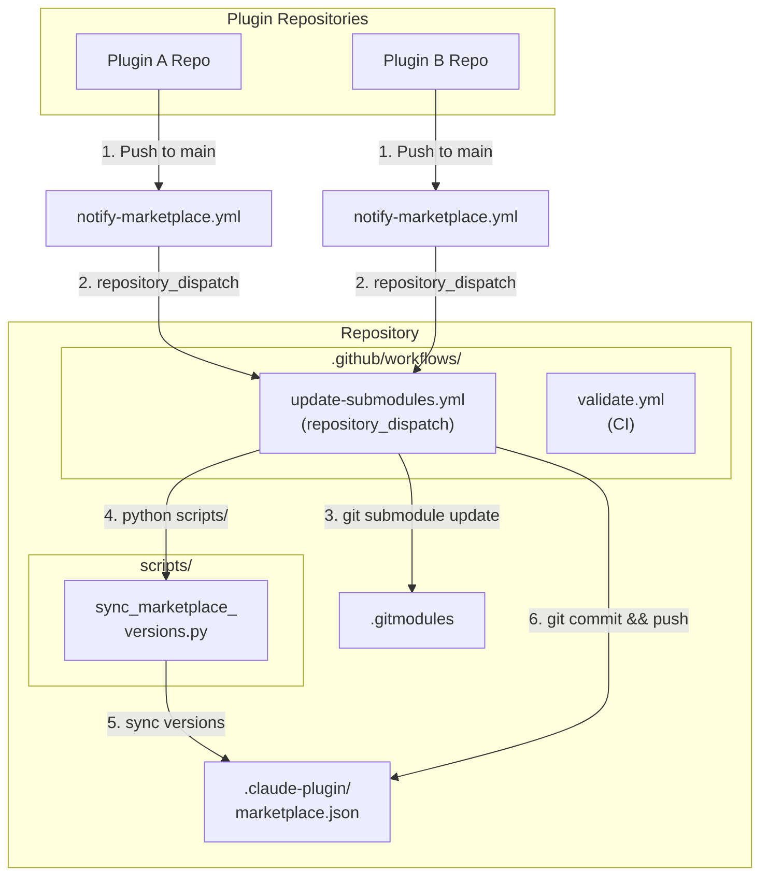

# README Template

## Table of Contents

- [Template Content](#template-content)
- [Placeholder Reference](#placeholder-reference)
- [Auto-Generation](#auto-generation)
- [Customization Guide](#customization-guide)

Reference for the auto-generated README.md that is placed in each marketplace repository. The template uses `<placeholder-for-...>` syntax and is filled in by `generate-readme.py`.

## Checklist

- [ ] Copy the template content into the target marketplace repo's README.md
- [ ] Either run `generate-readme.py` OR manually replace each `<placeholder-for-*>`
- [ ] Verify no placeholders remain (`grep -r 'placeholder-for-'`)
- [ ] Customize optional sections per the customization guide

---

## Template Content

Below is the full README template. Placeholders use `<placeholder-for-...>` syntax and are replaced at generation time. The plugin table between sentinel comments is fully auto-generated.

````markdown
# <placeholder-for-marketplace-name> Marketplace

[](https://github.com/<placeholder-for-github-repo-owner>/<placeholder-for-marketplace-repo-name>/actions/workflows/validate.yml)
[](https://github.com/<placeholder-for-github-repo-owner>/<placeholder-for-marketplace-repo-name>)
[](LICENSE)

<placeholder-for-marketplace-description>

This marketplace provides a centralized repository where Claude Code plugins are maintained as Git submodules, automatically updated when their source repositories change.

---

## Architecture



---

## Available Plugins

<!-- PLUGINS_TABLE_START -->
| Plugin | Description | Version | Author | Repository |
|--------|-------------|---------|--------|------------|
<!-- PLUGINS_TABLE_END -->

> This table is auto-generated by `generate-readme.py`. Do not edit manually.

---

## Installation

### Adding This Marketplace

```bash
# Register the marketplace with Claude Code (HTTPS)
claude plugin marketplace add <placeholder-for-marketplace-name> https://github.com/<placeholder-for-github-repo-owner>/<placeholder-for-marketplace-repo-name>.git

# Or using SSH
claude plugin marketplace add <placeholder-for-marketplace-name> git@github.com:<placeholder-for-github-repo-owner>/<placeholder-for-marketplace-repo-name>.git
```

### Installing a Plugin

```bash
# List all available plugins
claude plugin search @<placeholder-for-marketplace-name>

# Install a specific plugin
claude plugin install <plugin-name>@<placeholder-for-marketplace-name>

# Install with a specific scope
claude plugin install <plugin-name>@<placeholder-for-marketplace-name> --scope user
claude plugin install <plugin-name>@<placeholder-for-marketplace-name> --scope project
```

### Updating Plugins

```bash
# Update a specific plugin
claude plugin update <plugin-name>@<placeholder-for-marketplace-name>
```

---

## For Plugin Developers

### Adding Your Plugin

1. Ensure your plugin has a valid `.claude-plugin/plugin.json`
2. Add the notification workflow (see below)
3. Configure the `MARKETPLACE_PAT` secret
4. Open an issue in this repository requesting addition

### Notification Workflow

Create `.github/workflows/notify-marketplace.yml` in your plugin repository:

```yaml
name: Notify Marketplace

on:
  push:
    branches: [main]
    paths:
      - '.claude-plugin/plugin.json'
      - 'commands/**'
      - 'agents/**'
      - 'skills/**'
      - 'hooks/**'
      - 'scripts/**'

jobs:
  notify:
    runs-on: ubuntu-latest
    steps:
      - uses: actions/checkout@v4
      - name: Get plugin info
        id: plugin
        run: |
          echo "name=$(jq -r '.name' .claude-plugin/plugin.json)" >> $GITHUB_OUTPUT
          echo "version=$(jq -r '.version' .claude-plugin/plugin.json)" >> $GITHUB_OUTPUT
      - name: Notify marketplace
        uses: peter-evans/repository-dispatch@v4
        with:
          token: ${{ secrets.MARKETPLACE_PAT }}
          repository: <placeholder-for-github-repo-owner>/<placeholder-for-marketplace-repo-name>
          event-type: plugin-updated
          client-payload: >-
            {"plugin": "${{ steps.plugin.outputs.name }}",
             "version": "${{ steps.plugin.outputs.version }}"}
```

### PAT Configuration

Create a fine-grained GitHub token with `contents: write` permission on this marketplace repository, then set it as a secret in your plugin repository:

```bash
gh secret set MARKETPLACE_PAT --repo YOUR-ORG/YOUR-PLUGIN --body "ghp_your_token"
```

---

## Maintenance

### Rotating the PAT

1. Generate a new fine-grained token with the same permissions
2. Update the secret in every plugin repository that notifies this marketplace:
   ```bash
   gh secret set MARKETPLACE_PAT --repo OWNER/PLUGIN-REPO --body "ghp_new_token"
   ```
3. The old token can be revoked after all repositories are updated

### Manually Syncing Submodules

```bash
git submodule update --remote --merge
python scripts/sync_marketplace_versions.py
git add .
git commit -m "chore: manual submodule sync"
git push
```

### Updating Workflows

When workflow templates change, update them in each plugin repository. See the plugin linking guide for batch update instructions.

---

## Troubleshooting

| Issue | Resolution |
|-------|------------|
| Dispatch not triggering | Check PAT expiry and permissions |
| Submodule not updating | Run `git submodule update --remote` manually |
| Version mismatch | Run `sync_marketplace_versions.py` |
| Validation failing | Run `validate_marketplace_pipeline.py` for details |

For detailed troubleshooting, see the [Troubleshooting Guide](../references/troubleshooting.md).

---

## License

<placeholder-for-license-text>

Individual plugins maintain their own licenses. See each plugin's repository for details.
````

---

## Placeholder Reference

The following placeholders are recognized by `generate-readme.py` and replaced during generation:

| Placeholder | Source | Description |
|-------------|--------|-------------|
| `<placeholder-for-marketplace-name>` | `marketplace.json` > `name` | Display name of the marketplace |
| `<placeholder-for-github-repo-owner>` | GitHub API or CLI argument | GitHub owner (user or organization) |
| `<placeholder-for-marketplace-repo-name>` | GitHub API or CLI argument | Repository name on GitHub |
| `<placeholder-for-marketplace-description>` | `marketplace.json` > `description` | One-line marketplace description |
| `<placeholder-for-plugin-count>` | Computed | Number of plugins in `marketplace.json` |
| `<placeholder-for-license-type>` | `LICENSE` file or CLI argument | SPDX license identifier (e.g., `MIT`) |
| `<placeholder-for-license-text>` | `LICENSE` file | Full license notice sentence |

### Plugin Table Sentinels

The plugin table is bounded by HTML comments that act as sentinels:

```html
<!-- PLUGINS_TABLE_START -->
(auto-generated rows go here)
<!-- PLUGINS_TABLE_END -->
```

`generate-readme.py` replaces everything between these two markers. Content outside the markers is preserved. Each row is generated from `marketplace.json` plugin entries:

```
| {plugin.name} | {plugin.description} | {plugin.version} | {plugin.author} | [Link]({plugin.repository}) |
```

---

## Auto-Generation

### How generate-readme.py Works

1. Reads the template from `templates/README-marketplace.md` (or uses a built-in default)
2. Reads `.claude-plugin/marketplace.json` to extract marketplace metadata
3. Replaces all `<placeholder-for-...>` tokens with actual values
4. Builds the plugin table rows from the `plugins` array
5. Inserts the table between `<!-- PLUGINS_TABLE_START -->` and `<!-- PLUGINS_TABLE_END -->`
6. Writes the result to `README.md` at the repository root

### Running the Generator

```bash
# From the marketplace repository root
python scripts/generate-readme.py

# With explicit paths
python scripts/generate-readme.py --template templates/README-marketplace.md --output README.md
```

### When It Runs Automatically

The `update-submodules.yml` workflow calls `generate-readme.py` after syncing versions, so the README is always up to date when a plugin is updated.

---

## Customization Guide

### Adding Custom Sections

You can add custom sections to the generated README by editing the template. Any content outside the sentinel markers is preserved during regeneration. Place custom content above or below the sentinels:

```markdown
## My Custom Section

This content will not be overwritten by generate-readme.py.

<!-- PLUGINS_TABLE_START -->
(auto-generated)
<!-- PLUGINS_TABLE_END -->
```

### Changing the Badge Style

Edit the badge URLs in the template header. The default uses `shields.io` flat badges. Change the style parameter:

```markdown

```

### Adding Extra Placeholders

To add a custom placeholder:

1. Add the placeholder in the template: `<placeholder-for-custom-field>`
2. Update `generate-readme.py` to resolve it from the appropriate source (marketplace.json, CLI args, or environment)
3. Add a row to the Placeholder Reference table in this document

### Overriding the Mermaid Diagram

The architecture diagram in the template is static. If your marketplace has a different architecture (e.g., no submodules, webhook-based), replace the mermaid block in the template with your own diagram.
