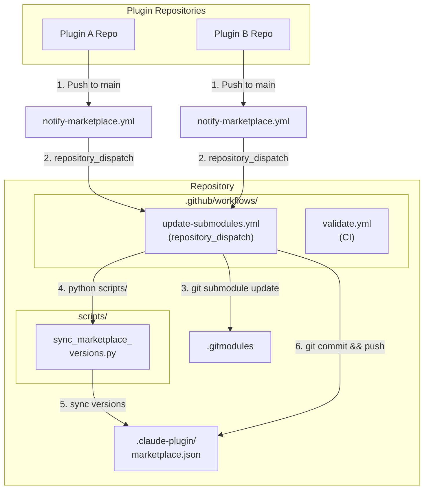

# README Template

## Table of Contents

- [Template Content](#template-content)
- [Placeholder Reference](#placeholder-reference)
- [Auto-Generation](#auto-generation)
- [Customization Guide](#customization-guide)

Reference for the README.md that is placed in each marketplace repository. The template uses `<placeholder-for-...>` syntax for the one-time setup fields (name, owner, license, …); the plugin table between the `<!-- PLUGIN-VERSIONS-START -->` / `<!-- PLUGIN-VERSIONS-END -->` markers is regenerated on every run by [render_readme_table.py](script-templates.md#render_readme_tablepy).

## Checklist

- [ ] Copy the template content into the target marketplace repo's README.md
- [ ] Manually replace each `<placeholder-for-*>` token (one-time setup — `render_readme_table.py` does not touch them)
- [ ] Verify no placeholders remain (`grep -r 'placeholder-for-'`)
- [ ] Run `render_readme_table.py` to populate the plugin table
- [ ] Customize optional sections per the customization guide

---

## Template Content

Below is the full README template. Placeholders use `<placeholder-for-...>` syntax and are replaced at generation time. The plugin table between sentinel comments is fully auto-generated.

````markdown
# <placeholder-for-marketplace-name> Marketplace

[](https://github.com/<placeholder-for-github-repo-owner>/<placeholder-for-marketplace-repo-name>/actions/workflows/validate.yml)
[](https://github.com/<placeholder-for-github-repo-owner>/<placeholder-for-marketplace-repo-name>)
[](LICENSE)

<placeholder-for-marketplace-description>

This marketplace provides a centralized repository where Claude Code plugins are maintained as Git submodules, automatically updated when their source repositories change.

---

## Architecture



---

<!-- PLUGIN-VERSIONS-START -->
## Plugin Versions

(auto-generated by `render_readme_table.py` — do not edit by hand)
<!-- PLUGIN-VERSIONS-END -->

> The heading, table, and `*N plugins*` count line above are all written by `render_readme_table.py`. Do not edit them manually — run the script instead.

---

## Installation

### Adding This Marketplace

```bash
# Register the marketplace with Claude Code (HTTPS)
claude plugin marketplace add <placeholder-for-marketplace-name> https://github.com/<placeholder-for-github-repo-owner>/<placeholder-for-marketplace-repo-name>.git

# Or using SSH
claude plugin marketplace add <placeholder-for-marketplace-name> git@github.com:<placeholder-for-github-repo-owner>/<placeholder-for-marketplace-repo-name>.git
```

### Installing a Plugin

```bash
# List all available plugins
claude plugin search @<placeholder-for-marketplace-name>

# Install a specific plugin
claude plugin install <plugin-name>@<placeholder-for-marketplace-name>

# Install with a specific scope
claude plugin install <plugin-name>@<placeholder-for-marketplace-name> --scope user
claude plugin install <plugin-name>@<placeholder-for-marketplace-name> --scope project
```

### Updating Plugins

```bash
# Update a specific plugin
claude plugin update <plugin-name>@<placeholder-for-marketplace-name>
```

---

## For Plugin Developers

### Adding Your Plugin

1. Ensure your plugin has a valid `.claude-plugin/plugin.json`
2. Add the notification workflow (see below)
3. Configure the `MARKETPLACE_PAT` secret
4. Open an issue in this repository requesting addition

### Notification Workflow

Create `.github/workflows/notify-marketplace.yml` in your plugin repository:

```yaml
name: Notify Marketplace

on:
  push:
    branches: [main]
    paths:
      - '.claude-plugin/plugin.json'
      - 'commands/**'
      - 'agents/**'
      - 'skills/**'
      - 'hooks/**'
      - 'scripts/**'

jobs:
  notify:
    runs-on: ubuntu-latest
    steps:
      - uses: actions/checkout@v4
      - name: Get plugin info
        id: plugin
        run: |
          echo "name=$(jq -r '.name' .claude-plugin/plugin.json)" >> $GITHUB_OUTPUT
          echo "version=$(jq -r '.version' .claude-plugin/plugin.json)" >> $GITHUB_OUTPUT
      - name: Notify marketplace
        uses: peter-evans/repository-dispatch@v4
        with:
          token: ${{ secrets.MARKETPLACE_PAT }}
          repository: <placeholder-for-github-repo-owner>/<placeholder-for-marketplace-repo-name>
          event-type: plugin-updated
          client-payload: >-
            {"plugin": "${{ steps.plugin.outputs.name }}",
             "version": "${{ steps.plugin.outputs.version }}"}
```

### PAT Configuration

Create a fine-grained GitHub token with `contents: write` permission on this marketplace repository, then set it as a secret in your plugin repository:

```bash
gh secret set MARKETPLACE_PAT --repo YOUR-ORG/YOUR-PLUGIN --body "ghp_your_token"
```

---

## Maintenance

### Rotating the PAT

1. Generate a new fine-grained token with the same permissions
2. Update the secret in every plugin repository that notifies this marketplace:
   ```bash
   gh secret set MARKETPLACE_PAT --repo OWNER/PLUGIN-REPO --body "ghp_new_token"
   ```
3. The old token can be revoked after all repositories are updated

### Manually Syncing Submodules

```bash
git submodule update --remote --merge
python scripts/sync_marketplace_versions.py
# `-u` (tracked only), never `git add .`/`-A` — issue #186. It stages the updated
# gitlinks at their arbitrary `plugins/<name>` paths plus the sync script's
# marketplace.json rewrite, without sweeping untracked files into the commit.
git add -u
git commit -m "chore: manual submodule sync"
git push
```

### Updating Workflows

When workflow templates change, update them in each plugin repository. See the plugin linking guide for batch update instructions.

---

## Troubleshooting

| Issue | Resolution |
|-------|------------|
| Dispatch not triggering | Check PAT expiry and permissions |
| Submodule not updating | Run `git submodule update --remote` manually |
| Version mismatch | Run `sync_marketplace_versions.py` |
| Validation failing | Run `validate_marketplace_pipeline.py` for details |

For detailed troubleshooting, see the [Troubleshooting Guide](../references/troubleshooting.md).

---

## License

<placeholder-for-license-text>

Individual plugins maintain their own licenses. See each plugin's repository for details.
````

---

## Placeholder Reference

These one-time setup placeholders are replaced BY HAND when the template is first copied into a repo — `render_readme_table.py` never touches them (it only rewrites the content between the plugin-versions markers, see below):

| Placeholder | Source | Description |
|-------------|--------|-------------|
| `<placeholder-for-marketplace-name>` | `marketplace.json` > `name` | Display name of the marketplace |
| `<placeholder-for-github-repo-owner>` | GitHub API or manual entry | GitHub owner (user or organization) |
| `<placeholder-for-marketplace-repo-name>` | GitHub API or manual entry | Repository name on GitHub |
| `<placeholder-for-marketplace-description>` | `marketplace.json` > `description` | One-line marketplace description |
| `<placeholder-for-plugin-count>` | `marketplace.json` `plugins` length | Number of plugins in `marketplace.json` (update by hand alongside the badge — the table's own generated count line refreshes automatically) |
| `<placeholder-for-license-type>` | `LICENSE` file or manual entry | SPDX license identifier (e.g., `MIT`) |
| `<placeholder-for-license-text>` | `LICENSE` file | Full license notice sentence |

### Plugin Table Markers

The plugin table — heading, table, and `*N plugins*` count line — is bounded by the canonical HTML-comment markers:

```html
<!-- PLUGIN-VERSIONS-START -->
## Plugin Versions
(auto-generated rows go here)
<!-- PLUGIN-VERSIONS-END -->
```

`render_readme_table.py` replaces everything between these two markers, in place, on every run. Content outside the markers is preserved. Each row is generated from `marketplace.json` plugin entries:

```
| [{plugin.name}]({plugin.repository or source url}) | {plugin.version} | {plugin.category} | {plugin.description} |
```

---

## Auto-Generation

### How render_readme_table.py Works

1. Reads `.claude-plugin/marketplace.json` to extract the `plugins` array (errors out if it is missing or empty — a rendering bug must never silently blank the table)
2. Builds one table row per plugin, sorted by name, linking to `repository` or the `source` GitHub repo when available
3. Rewrites everything between `<!-- PLUGIN-VERSIONS-START -->` and `<!-- PLUGIN-VERSIONS-END -->` in `README.md` at the repository root with the new heading + table + a `*N plugins*` line. The block carries no generation date on purpose: `--check` compares the rendered text, so a date would differ every midnight and fail the CI gate on an unchanged manifest

It does NOT read a separate template file and does NOT touch any `<placeholder-for-...>` token — those are one-time setup fields, replaced by hand.

### Running the Generator

```bash
# From the marketplace repository root — rewrites README.md in place
python3 scripts/render_readme_table.py

# CI gate — exits 1 if README.md would change, makes no edits
python3 scripts/render_readme_table.py --check
```

### When It Runs Automatically

The "Update Versions" workflow (`update-submodules.yml`) runs `render_readme_table.py` after syncing plugin versions, BEFORE the "Check for changes" step, and stages `README.md` in the same commit as `marketplace.json` — see [workflow-templates.md](workflow-templates.md). The `validate.yml` CI workflow separately runs `render_readme_table.py --check` so a stale table fails the build instead of silently drifting.

---

## Customization Guide

### Adding Custom Sections

You can add custom sections to the README. Any content outside the plugin-versions markers is preserved during regeneration. Place custom content above or below the markers:

```markdown
## My Custom Section

This content will not be overwritten by render_readme_table.py.

<!-- PLUGIN-VERSIONS-START -->
## Plugin Versions
(auto-generated)
<!-- PLUGIN-VERSIONS-END -->
```

### Changing the Badge Style

Edit the badge URLs in the template header. The default uses `shields.io` flat badges. Change the style parameter:

```markdown

```

### Changing the Table's Columns or Sort Order

The rendered table's shape (`Plugin | Version | Category | Description`, sorted by name) is defined entirely in `render_readme_table.py`'s `render()` function — edit the script directly; there is no template file or placeholder involved.

### Overriding the Mermaid Diagram

The architecture diagram in the template is static. If your marketplace has a different architecture (e.g., no submodules, webhook-based), replace the mermaid block in the template with your own diagram.
