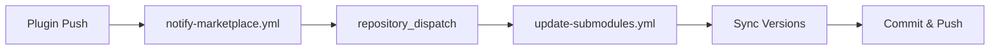

# Marketplace -- Validation Issues and Fixes

Comprehensive remediation guide for all issues detected by `validate_marketplace.py` and `validate_marketplace_pipeline.py`.

## Table of Contents

- [1. marketplace.json Structure Issues](#1-marketplacejson-structure-issues)
- [2. Plugin Entry Issues](#2-plugin-entry-issues)
- [3. Source Type Issues](#3-source-type-issues)
- [4. Git Submodule Issues](#4-git-submodule-issues)
- [5. Pipeline Workflow Issues](#5-pipeline-workflow-issues)
- [6. Version Sync Issues](#6-version-sync-issues)
- [7. Secret Configuration Issues](#7-secret-configuration-issues)
- [8. GitHub Deployment Issues](#8-github-deployment-issues)

---

## 1. marketplace.json Structure Issues

These errors come from `validate_marketplace_file()`, `validate_marketplace_name()`, `validate_marketplace()`, and `validate_marketplace_structure()` (pipeline).

---

### 1.1 marketplace.json not found

| Field | Value |
|-------|-------|
| **Script** | `validate_marketplace.py` / `validate_marketplace_pipeline.py` |
| **Severity** | CRITICAL |
| **Message** | `Marketplace configuration not found: <path>` / `marketplace.json not found` |
| **Category** | `structure` / `marketplace_structure` |
| **Suggestion** | Create a marketplace.json file with name and plugins fields |

**Root Cause:** The validator looks for `marketplace.json` at the marketplace root first, then falls back to `.claude-plugin/marketplace.json`. Neither file was found.

**Fix:**
```bash
# Create the file in the marketplace root
touch marketplace.json
```

Then populate with the minimum required structure:
```json
{
  "name": "my-marketplace",
  "owner": {
    "name": "YourGitHubUsername"
  },
  "plugins": []
}
```

For the pipeline validator, the `version` field is also required:
```json
{
  "name": "my-marketplace",
  "version": "1.0.0",
  "plugins": []
}
```

---

### 1.2 Invalid JSON in marketplace.json

| Field | Value |
|-------|-------|
| **Script** | `validate_marketplace.py` / `validate_marketplace_pipeline.py` |
| **Severity** | CRITICAL |
| **Message** | `Invalid JSON in marketplace.json: <error>` / `marketplace.json has invalid JSON: <error>` |
| **Category** | `manifest` / `marketplace_structure` |
| **Suggestion** | Fix JSON syntax error / Fix JSON syntax errors |

**Root Cause:** The file contains malformed JSON (trailing commas, unquoted keys, missing brackets, etc.).

**Fix:**
1. Run a JSON linter: `python3 -m json.tool marketplace.json`
2. Common issues: trailing commas after last array/object element, single quotes instead of double quotes, missing closing braces.

---

### 1.3 Error reading marketplace.json

| Field | Value |
|-------|-------|
| **Script** | `validate_marketplace.py` |
| **Severity** | CRITICAL |
| **Message** | `Error reading marketplace.json: <error>` |
| **Category** | `manifest` |

**Root Cause:** File permission issue, encoding problem, or corrupted file.

**Fix:**
1. Check file permissions: `ls -la marketplace.json`
2. Ensure UTF-8 encoding: `file marketplace.json`
3. If permissions are wrong: `chmod 644 marketplace.json`

---

### 1.4 marketplace.json must be a JSON object

| Field | Value |
|-------|-------|
| **Script** | `validate_marketplace.py` |
| **Severity** | CRITICAL |
| **Message** | `marketplace.json must be a JSON object` |
| **Category** | `manifest` |
| **Suggestion** | Root element should be a JSON object with name and plugins fields |

**Root Cause:** The root JSON element is an array, string, number, or null instead of an object `{}`.

**Fix:** Ensure the file starts with `{` and ends with `}` at the top level.

---

### 1.5 Missing required fields

| Field | Value |
|-------|-------|
| **Script** | `validate_marketplace.py` / `validate_marketplace_pipeline.py` |
| **Severity** | CRITICAL |
| **Message** | `Missing required field: <field>` / `marketplace.json missing required fields: <fields>` |
| **Category** | `manifest` / `marketplace_structure` |
| **Suggestion** | Add missing fields: `<fields>` |

**Root Cause:** The marketplace.json is missing one or more of the required top-level fields.

- `validate_marketplace.py` requires: `name`, `owner`, `plugins`
- `validate_marketplace_pipeline.py` requires: `name`, `version`, `plugins`

**Fix:** Add all missing fields:
```json
{
  "name": "my-marketplace",
  "version": "1.0.0",
  "owner": {
    "name": "YourGitHubUsername"
  },
  "plugins": []
}
```

---

### 1.6 Cannot validate required fields - marketplace.json is invalid

| Field | Value |
|-------|-------|
| **Script** | `validate_marketplace_pipeline.py` |
| **Severity** | CRITICAL |
| **Message** | `Cannot validate required fields - marketplace.json is invalid` |
| **Category** | `marketplace_structure` |

**Root Cause:** JSON parsing failed, so field checks cannot proceed.

**Fix:** Resolve the JSON syntax errors first (see issue 1.2).

---

### 1.7 Marketplace name must be a string

| Field | Value |
|-------|-------|
| **Script** | `validate_marketplace.py` |
| **Severity** | CRITICAL |
| **Message** | `Marketplace name must be a string, got <type>` |
| **Category** | `manifest` |

**Root Cause:** The `name` field is a number, boolean, array, or object instead of a string.

**Fix:**
```json
{
  "name": "my-marketplace"
}
```

---

### 1.8 Marketplace name cannot be empty

| Field | Value |
|-------|-------|
| **Script** | `validate_marketplace.py` |
| **Severity** | CRITICAL |
| **Message** | `Marketplace name cannot be empty` |
| **Category** | `manifest` |

**Root Cause:** The `name` field is an empty string `""`.

**Fix:** Provide a meaningful marketplace name in kebab-case:
```json
{
  "name": "my-awesome-plugins"
}
```

---

### 1.9 Marketplace name should use kebab-case

| Field | Value |
|-------|-------|
| **Script** | `validate_marketplace.py` |
| **Severity** | MINOR |
| **Message** | `Marketplace name '<name>' should use kebab-case (lowercase with hyphens)` |
| **Category** | `manifest` |
| **Suggestion** | Use format: my-marketplace-name |

**Root Cause:** The name contains uppercase letters, underscores, spaces, or starts with a digit. Must match: `^[a-z][a-z0-9]*(-[a-z0-9]+)*$`

**Fix:** Convert to kebab-case. Examples:
- `MyMarketplace` -> `my-marketplace`
- `my_marketplace` -> `my-marketplace`
- `123-market` -> `market-123`

---

### 1.10 Marketplace name is reserved

| Field | Value |
|-------|-------|
| **Script** | `validate_marketplace.py` |
| **Severity** | CRITICAL |
| **Message** | `Marketplace name '<name>' is reserved and cannot be used` |
| **Category** | `marketplace` |

**Root Cause:** The name matches one of the reserved names: `claude-code-marketplace`, `claude-code-plugins`, `claude-plugins-official`, `anthropic-marketplace`, `anthropic-plugins`, `agent-skills`, `life-sciences`.

**Fix:** Choose a different, non-reserved marketplace name.

---

### 1.11 Owner object missing required 'name' field

| Field | Value |
|-------|-------|
| **Script** | `validate_marketplace.py` |
| **Severity** | MAJOR |
| **Message** | `'owner' object missing required 'name' field` |
| **Category** | `marketplace` |

**Root Cause:** The `owner` field is a JSON object but does not contain a `name` key.

**Fix:**
```json
{
  "owner": {
    "name": "YourGitHubUsername"
  }
}
```

---

### 1.12 Owner must be an object

| Field | Value |
|-------|-------|
| **Script** | `validate_marketplace.py` |
| **Severity** | MAJOR |
| **Message** | `'owner' must be an object with a 'name' field, got <type>` |
| **Category** | `marketplace` |

**Root Cause:** The `owner` field is a string, number, or array instead of an object.

**Fix:**
```json
{
  "owner": {
    "name": "YourGitHubUsername"
  }
}
```

---

### 1.13 description field must be a string

| Field | Value |
|-------|-------|
| **Script** | `validate_marketplace.py` |
| **Severity** | MINOR |
| **Message** | `description field must be a string` |
| **Category** | `manifest` |

**Root Cause:** The optional `description` field is present but not a string type.

**Fix:**
```json
{
  "description": "A collection of useful Claude Code plugins."
}
```

---

### 1.14 version field must be a string

| Field | Value |
|-------|-------|
| **Script** | `validate_marketplace.py` |
| **Severity** | MINOR |
| **Message** | `version field must be a string` |
| **Category** | `manifest` |

**Root Cause:** The optional `version` field is present but not a string (e.g., a number like `1.0` instead of `"1.0.0"`).

**Fix:**
```json
{
  "version": "1.0.0"
}
```

---

### 1.15 Marketplace version should follow semver format

| Field | Value |
|-------|-------|
| **Script** | `validate_marketplace.py` |
| **Severity** | MINOR |
| **Message** | `Marketplace version '<version>' should follow semver format` |
| **Category** | `manifest` |

**Root Cause:** The version string does not match the semver pattern (X.Y.Z).

**Fix:** Use semantic versioning: `"1.0.0"`, `"2.3.1"`, etc.

---

### 1.16 plugins field must be an array

| Field | Value |
|-------|-------|
| **Script** | `validate_marketplace.py` |
| **Severity** | CRITICAL |
| **Message** | `plugins field must be an array` |
| **Category** | `manifest` |
| **Suggestion** | `plugins: [{name: 'plugin-a'}, {name: 'plugin-b'}]` |

**Root Cause:** The `plugins` field is an object, string, or other non-array type.

**Fix:**
```json
{
  "plugins": [
    {"name": "my-plugin", "source": "./my-plugin"}
  ]
}
```

---

### 1.17 plugins array is empty

| Field | Value |
|-------|-------|
| **Script** | `validate_marketplace.py` |
| **Severity** | MINOR |
| **Message** | `plugins array is empty` |
| **Category** | `manifest` |

**Root Cause:** The `plugins` field is `[]` with no entries.

**Fix:** Add at least one plugin entry to the array.

---

### 1.18 plugins[i] must be an object

| Field | Value |
|-------|-------|
| **Script** | `validate_marketplace.py` |
| **Severity** | CRITICAL |
| **Message** | `plugins[<i>] must be an object, got <type>` |
| **Category** | `plugin` |

**Root Cause:** An element in the plugins array is a string, number, or other non-object type.

**Fix:** Each plugin must be a JSON object:
```json
{
  "plugins": [
    {"name": "my-plugin", "source": "./my-plugin"}
  ]
}
```

---

### 1.19 Duplicate plugin name

| Field | Value |
|-------|-------|
| **Script** | `validate_marketplace.py` |
| **Severity** | MAJOR |
| **Message** | `Duplicate plugin name: <name>` |
| **Category** | `plugin` |
| **Suggestion** | Each plugin must have a unique name |

**Root Cause:** Two or more plugins in the array share the same `name` value.

**Fix:** Rename one of the duplicates to a unique name.

---

## 2. Plugin Entry Issues

These errors come from `validate_plugin_entry()`, `validate_local_path()`, `validate_repository_url()`, and `validate_github_source_required()`.

---

### 2.1 Plugin missing required field

| Field | Value |
|-------|-------|
| **Script** | `validate_marketplace.py` |
| **Severity** | CRITICAL |
| **Message** | `Plugin '<id>' missing required field: <field>` |
| **Category** | `plugin` |

**Root Cause:** A plugin entry is missing `name` or `source`.

**Fix:** Every plugin must have at minimum `name` and `source`:
```json
{
  "name": "my-plugin",
  "source": "./my-plugin"
}
```

---

### 2.2 Plugin name should use kebab-case

| Field | Value |
|-------|-------|
| **Script** | `validate_marketplace.py` |
| **Severity** | MINOR |
| **Message** | `Plugin name '<name>' should use kebab-case` |
| **Category** | `plugin` |
| **Suggestion** | Use format: my-plugin-name |

**Root Cause:** Plugin name does not match `^[a-z][a-z0-9]*(-[a-z0-9]+)*$`.

**Fix:** Convert to lowercase kebab-case (e.g., `my-plugin-name`).

---

### 2.3 Plugin version must be a string

| Field | Value |
|-------|-------|
| **Script** | `validate_marketplace.py` |
| **Severity** | MAJOR |
| **Message** | `Plugin '<id>' version must be a string` |
| **Category** | `plugin` |

**Root Cause:** The `version` field is not a string (e.g., a number).

**Fix:**
```json
{
  "version": "1.0.0"
}
```

---

### 2.4 Plugin version should follow semver format

| Field | Value |
|-------|-------|
| **Script** | `validate_marketplace.py` |
| **Severity** | MINOR |
| **Message** | `Plugin '<id>' version '<version>' should follow semver format` |
| **Category** | `plugin` |
| **Suggestion** | Use format: X.Y.Z (e.g., 1.0.0) |

**Root Cause:** The version string does not follow semantic versioning.

**Fix:** Use `"X.Y.Z"` format (e.g., `"1.0.0"`, `"2.1.3"`).

---

### 2.5 Plugin has unknown field

| Field | Value |
|-------|-------|
| **Script** | `validate_marketplace.py` |
| **Severity** | INFO |
| **Message** | `Plugin '<id>' has unknown field: <field>` |
| **Category** | `plugin` |

**Root Cause:** The plugin entry contains a field not in the known set (`name`, `source`, `version`, `description`, `path`, `repository`, `author`, `tags`, `keywords`, `license`, `category`, `dependencies`, `enabled`, `strict`, `homepage`, `commands`, `agents`, `skills`, `hooks`, `mcpServers`, `lspServers`, `outputStyles`).

**Fix:** Remove the unknown field or check for typos. This is informational only.

---

### 2.6 Plugin tags must be an array

| Field | Value |
|-------|-------|
| **Script** | `validate_marketplace.py` |
| **Severity** | MINOR |
| **Message** | `Plugin '<id>' tags must be an array` |
| **Category** | `plugin` |

**Root Cause:** The `tags` field is not a JSON array.

**Fix:**
```json
{
  "tags": ["utility", "git", "automation"]
}
```

---

### 2.7 Plugin tags must be strings

| Field | Value |
|-------|-------|
| **Script** | `validate_marketplace.py` |
| **Severity** | MINOR |
| **Message** | `Plugin '<id>' tags must be strings` |
| **Category** | `plugin` |

**Root Cause:** One or more elements in the `tags` array are not strings (e.g., numbers or objects).

**Fix:** Ensure all tag values are strings.

---

### 2.8 Plugin dependencies must be an array

| Field | Value |
|-------|-------|
| **Script** | `validate_marketplace.py` |
| **Severity** | MAJOR |
| **Message** | `Plugin '<id>' dependencies must be an array` |
| **Category** | `plugin` |

**Root Cause:** The `dependencies` field is not a JSON array.

**Fix:**
```json
{
  "dependencies": ["other-plugin-name"]
}
```

---

### 2.9 Plugin dependencies must be strings

| Field | Value |
|-------|-------|
| **Script** | `validate_marketplace.py` |
| **Severity** | MAJOR |
| **Message** | `Plugin '<id>' dependencies must be strings` |
| **Category** | `plugin` |

**Root Cause:** One or more elements in the `dependencies` array are not strings.

**Fix:** Ensure all dependency names are strings.

---

### 2.10 Plugin path must be a string

| Field | Value |
|-------|-------|
| **Script** | `validate_marketplace.py` |
| **Severity** | MAJOR |
| **Message** | `Plugin '<id>' path must be a string` |
| **Category** | `plugin` |

**Root Cause:** The `path` field is not a string type.

**Fix:**
```json
{
  "path": "./my-plugin"
}
```

---

### 2.11 Plugin uses absolute path

| Field | Value |
|-------|-------|
| **Script** | `validate_marketplace.py` |
| **Severity** | CRITICAL |
| **Message** | `Plugin '<id>' uses absolute path: <path>` |
| **Category** | `plugin` |
| **Suggestion** | Absolute paths expose local filesystem structure and may contain usernames. Use relative paths (starting with ./) for local plugin references. Example: './<dirname>' instead of '<absolute_path>' |

**Root Cause:** The `path` field starts with `/`, exposing local filesystem structure (including potential usernames) in the published marketplace.

**Fix:** Convert to a relative path:
```json
{
  "path": "./my-plugin"
}
```

---

### 2.12 Plugin local path does not exist

| Field | Value |
|-------|-------|
| **Script** | `validate_marketplace.py` |
| **Severity** | MAJOR |
| **Message** | `Plugin '<id>' local path does not exist: <resolved>` |
| **Category** | `plugin` |
| **Suggestion** | Ensure the path is relative to the marketplace directory or use absolute path |

**Root Cause:** The path specified does not resolve to an existing directory.

**Fix:**
1. Verify the directory exists at the expected location relative to marketplace.json.
2. If using git submodules, run `git submodule update --init --recursive`.

---

### 2.13 Plugin local path is not a directory

| Field | Value |
|-------|-------|
| **Script** | `validate_marketplace.py` |
| **Severity** | MAJOR |
| **Message** | `Plugin '<id>' local path is not a directory: <resolved>` |
| **Category** | `plugin` |

**Root Cause:** The path resolves to a file rather than a directory.

**Fix:** The path should point to the plugin's root directory, not a file.

---

### 2.14 Plugin directory missing plugin.json

| Field | Value |
|-------|-------|
| **Script** | `validate_marketplace.py` |
| **Severity** | MAJOR |
| **Message** | `Plugin '<id>' directory missing plugin.json` |
| **Category** | `plugin` |
| **Suggestion** | Add .claude-plugin/plugin.json to the plugin directory |

**Root Cause:** The plugin directory exists but contains neither `.claude-plugin/plugin.json` nor `plugin.json` at its root.

**Fix:**
```bash
mkdir -p my-plugin/.claude-plugin
cat > my-plugin/.claude-plugin/plugin.json << 'EOF'
{
  "name": "my-plugin",
  "version": "1.0.0",
  "description": "My plugin description"
}
EOF
```

---

### 2.15 Plugin path contains '..' (path traversal)

| Field | Value |
|-------|-------|
| **Script** | `validate_marketplace.py` |
| **Severity** | MINOR |
| **Message** | `Plugin '<id>' path contains '..' (path traversal)` |
| **Category** | `plugin` |
| **Suggestion** | Use absolute paths or paths without parent directory references |

**Root Cause:** The `path` field contains `..` segments.

**Fix:** Restructure so the plugin is at or below the marketplace root, removing `..` references.

---

### 2.16 Plugin repository must be a string

| Field | Value |
|-------|-------|
| **Script** | `validate_marketplace.py` |
| **Severity** | MINOR |
| **Message** | `Plugin '<id>' repository must be a string` |
| **Category** | `plugin` |

**Root Cause:** The `repository` field is not a string.

**Fix:**
```json
{
  "repository": "https://github.com/owner/repo"
}
```

---

### 2.17 Plugin repository URL may be invalid

| Field | Value |
|-------|-------|
| **Script** | `validate_marketplace.py` |
| **Severity** | MINOR |
| **Message** | `Plugin '<id>' repository URL may be invalid: <url>` |
| **Category** | `plugin` |
| **Suggestion** | Use full URL or GitHub shorthand (owner/repo) |

**Root Cause:** The URL has no scheme and does not look like a GitHub shorthand (owner/repo).

**Fix:** Use a full URL:
```json
{
  "repository": "https://github.com/owner/repo"
}
```

---

### 2.18 Plugin repository has unusual scheme

| Field | Value |
|-------|-------|
| **Script** | `validate_marketplace.py` |
| **Severity** | MINOR |
| **Message** | `Plugin '<id>' repository has unusual scheme: <scheme>` |
| **Category** | `plugin` |

**Root Cause:** The URL uses a scheme other than `http`, `https`, `git`, or `ssh`.

**Fix:** Use an `https://` URL for the repository.

---

### 2.19 Plugin repository URL could not be parsed

| Field | Value |
|-------|-------|
| **Script** | `validate_marketplace.py` |
| **Severity** | MINOR |
| **Message** | `Plugin '<id>' repository URL could not be parsed` |
| **Category** | `plugin` |

**Root Cause:** The URL string is malformed and cannot be parsed by Python's `urlparse`.

**Fix:** Use a well-formed URL: `https://github.com/owner/repo`

---

### 2.20 Plugin missing 'repository' field for GitHub publishing

| Field | Value |
|-------|-------|
| **Script** | `validate_marketplace.py` |
| **Severity** | MAJOR |
| **Message** | `Plugin '<name>' missing 'repository' field - required for GitHub marketplace publishing` |
| **Category** | `github-source` |
| **Suggestion** | `Add: "repository": "https://github.com/OWNER/<name>"` |

**Root Cause:** The plugin lacks a `repository` field, which is required for users to discover the plugin's GitHub repo.

**Fix:**
```json
{
  "name": "my-plugin",
  "repository": "https://github.com/YourUsername/my-plugin"
}
```

---

### 2.21 Plugin repository must be a string URL (github-source)

| Field | Value |
|-------|-------|
| **Script** | `validate_marketplace.py` |
| **Severity** | MAJOR |
| **Message** | `Plugin '<name>' repository must be a string URL` |
| **Category** | `github-source` |

**Root Cause:** The `repository` field exists but is not a string.

**Fix:** Set the value to a string URL.

---

### 2.22 Plugin repository doesn't look like a GitHub URL

| Field | Value |
|-------|-------|
| **Script** | `validate_marketplace.py` |
| **Severity** | MINOR |
| **Message** | `Plugin '<name>' repository doesn't look like a GitHub URL: <url>` |
| **Category** | `github-source` |
| **Suggestion** | Use format: https://github.com/OWNER/REPO |

**Root Cause:** The URL does not start with `https://github.com/`, `git@github.com:`, and does not contain a `/` (shorthand format).

**Fix:**
```json
{
  "repository": "https://github.com/owner/repo"
}
```

---

### 2.23 Plugin uses remote source instead of local submodule

| Field | Value |
|-------|-------|
| **Script** | `validate_marketplace.py` |
| **Severity** | INFO |
| **Message** | `Plugin '<name>' uses remote source instead of local submodule` |
| **Category** | `github-source` |
| **Suggestion** | Consider using git submodules with source: './<plugin_name>' |

**Root Cause:** The plugin's `source` starts with `http` or `git@` instead of a local `./` path. For submodule-based marketplaces, local paths are preferred.

**Fix:** If you want to use submodules:
```json
{
  "source": "./my-plugin",
  "repository": "https://github.com/owner/my-plugin"
}
```

---

## 3. Source Type Issues

These errors come from `validate_plugin_source()`.

---

### 3.1 Plugin source path does not exist (string shorthand)

| Field | Value |
|-------|-------|
| **Script** | `validate_marketplace.py` |
| **Severity** | MAJOR |
| **Message** | `Plugin '<id>' source path does not exist: <resolved>` |
| **Category** | `plugin` |
| **Suggestion** | Ensure the plugin directory exists at the specified path |

**Root Cause:** When `source` is a relative path string (`./path` or `../path`), the resolved directory does not exist.

**Fix:** Ensure the plugin directory exists, or initialize the submodule:
```bash
git submodule update --init --recursive
```

---

### 3.1b Plugin source contains '..' path traversal (CRITICAL)

| Field | Value |
|-------|-------|
| **Script** | `validate_marketplace.py` |
| **Severity** | CRITICAL |
| **Message** | `Plugin '<id>' source contains '..' (path traversal blocked by Claude Code)` |
| **Category** | `plugin` |

**Root Cause:** Plugin source path uses `../` to reference a parent directory. Claude Code blocks this for security — plugins cannot reference files outside their directory.

**Fix:** Move the plugin directory inside the marketplace root, or use a `github` source type:
```json
// WRONG — blocked by Claude Code
{"name": "my-plugin", "source": "../shared/my-plugin"}

// CORRECT — relative to marketplace root
{"name": "my-plugin", "source": "./plugins/my-plugin"}

// CORRECT — GitHub source
{"name": "my-plugin", "source": {"source": "github", "repo": "owner/my-plugin"}}
```

---

### 3.2 Plugin has invalid source type (string)

| Field | Value |
|-------|-------|
| **Script** | `validate_marketplace.py` |
| **Severity** | MAJOR |
| **Message** | `Plugin '<id>' has invalid source type: <source>` |
| **Category** | `plugin` |
| **Suggestion** | Valid source types: github, npm, pip, url or relative path (./path) |

**Root Cause:** The `source` string is not one of the valid types (`github`, `url`, `npm`, `pip`) and does not start with `./` or `../`.

**Fix:** Use a valid source value:
```json
{"source": "github"}
```
or a relative path:
```json
{"source": "./my-plugin"}
```

---

### 3.3 Plugin source must be a string or object

| Field | Value |
|-------|-------|
| **Script** | `validate_marketplace.py` |
| **Severity** | MAJOR |
| **Message** | `Plugin '<id>' source must be a string or object` |
| **Category** | `plugin` |

**Root Cause:** The `source` field is a number, boolean, null, or array.

**Fix:** Use either a string or an object:
```json
{"source": "./my-plugin"}
```
or:
```json
{"source": {"source": "github", "repo": "owner/repo"}}
```

---

### 3.4 Plugin source object missing 'source' field

| Field | Value |
|-------|-------|
| **Script** | `validate_marketplace.py` |
| **Severity** | MAJOR |
| **Message** | `Plugin '<id>' source missing 'source' field` |
| **Category** | `plugin` |
| **Suggestion** | Add source: github, npm, pip, url |

**Root Cause:** When `source` is an object, it must contain an inner `source` key to indicate the type.

**Fix:**
```json
{
  "source": {
    "source": "github",
    "repo": "owner/repo"
  }
}
```

---

### 3.5 Plugin has invalid source type (object)

| Field | Value |
|-------|-------|
| **Script** | `validate_marketplace.py` |
| **Severity** | MAJOR |
| **Message** | `Plugin '<id>' has invalid source type: <type>` |
| **Category** | `plugin` |
| **Suggestion** | Valid source types: github, npm, pip, url |

**Root Cause:** The `source.source` value is not one of `github`, `url`, `npm`, `pip`.

**Fix:** Use a valid source type string.

---

### 3.6 Plugin source type requires specific field

| Field | Value |
|-------|-------|
| **Script** | `validate_marketplace.py` |
| **Severity** | MAJOR |
| **Message** | `Plugin '<id>' with source type '<type>' requires '<field>'` |
| **Category** | `plugin` |

**Root Cause:** Source-specific required fields are missing:
- `github` requires `repo`
- `url` requires `url`
- `npm` requires `package`
- `pip` requires `package`

**Fix for github:**
```json
{
  "source": {
    "source": "github",
    "repo": "owner/repo-name"
  }
}
```

**Fix for npm:**
```json
{
  "source": {
    "source": "npm",
    "package": "@scope/package-name"
  }
}
```

**Fix for pip:**
```json
{
  "source": {
    "source": "pip",
    "package": "package-name"
  }
}
```

**Fix for url:**
```json
{
  "source": {
    "source": "url",
    "url": "https://example.com/plugin.tar.gz"
  }
}
```

---

### 3.7 Plugin source 'sha' must be a 40-character hex string

| Field | Value |
|-------|-------|
| **Script** | `validate_marketplace.py` |
| **Severity** | MINOR |
| **Message** | `Plugin '<id>' source 'sha' must be a 40-character hex string` |
| **Category** | `source` |

**Root Cause:** The optional `sha` field does not match the pattern `^[0-9a-f]{40}$`.

**Fix:** Use a full 40-character lowercase hex SHA:
```json
{
  "source": {
    "source": "github",
    "repo": "owner/repo",
    "sha": "a1b2c3d4e5f6a1b2c3d4e5f6a1b2c3d4e5f6a1b2"
  }
}
```

---

### 3.8 Plugin uses remote source but exists as local submodule

| Field | Value |
|-------|-------|
| **Script** | `validate_marketplace.py` |
| **Severity** | MAJOR |
| **Message** | `Plugin '<id>' uses remote source but exists as local submodule` |
| **Category** | `plugin` |
| **Suggestion** | Remove the local submodule checkout at './<name>' or change source to a relative path string |

**Root Cause:** The plugin's source type is `github` or `url`, but the plugin directory exists locally as a git submodule (has a `.git` file).

**Fix:** Either:
1. Change source to local: `"source": "./<plugin-name>"`
2. Or remove the local submodule: `git rm <plugin-name>`

---

## 4. Git Submodule Issues

These errors come from `validate_git_submodules()` (marketplace validator) and `validate_submodule_health()` (pipeline validator).

---

### 4.1 Marketplace is not a git repository

| Field | Value |
|-------|-------|
| **Script** | `validate_marketplace.py` |
| **Severity** | INFO |
| **Message** | `Marketplace is not a git repository, skipping submodule validation` |
| **Category** | `submodule` |

**Root Cause:** No `.git` directory found at marketplace root.

**Fix:** Initialize a git repository:
```bash
git init
```

---

### 4.2 Missing .gitmodules file (with local plugin directories)

| Field | Value |
|-------|-------|
| **Script** | `validate_marketplace.py` / `validate_marketplace_pipeline.py` |
| **Severity** | MAJOR / CRITICAL |
| **Message** | `Missing .gitmodules file - local plugin directories exist but are not git submodules` / `.gitmodules not found - plugins should be git submodules` |
| **Category** | `submodule` / `marketplace_structure` |
| **Suggestion** | Either convert local directories to git submodules with 'git submodule add <repo-url> <plugin-name>', or switch all plugins to URL-based sources / Initialize plugins as git submodules with: git submodule add <url> <path> |

**Root Cause:** Plugin directories exist locally but `.gitmodules` is missing, indicating they are not proper submodules.

**Fix:**
```bash
# For each plugin, add it as a submodule
git submodule add https://github.com/owner/plugin-name plugin-name
```

---

### 4.3 Could not parse .gitmodules file

| Field | Value |
|-------|-------|
| **Script** | `validate_marketplace.py` |
| **Severity** | MAJOR |
| **Message** | `Could not parse .gitmodules file: <error>` |
| **Category** | `submodule` |

**Root Cause:** The `.gitmodules` file has invalid syntax.

**Fix:** Check and fix the `.gitmodules` INI-style format:
```ini
[submodule "my-plugin"]
    path = my-plugin
    url = https://github.com/owner/my-plugin.git
```

---

### 4.4 Plugin directory exists but is not a git submodule

| Field | Value |
|-------|-------|
| **Script** | `validate_marketplace.py` |
| **Severity** | MAJOR |
| **Message** | `Plugin '<name>' directory exists but is not a git submodule` |
| **Category** | `submodule` |
| **Suggestion** | Convert to submodule: 'git rm -r <name> && git submodule add <repo-url> <name>' |

**Root Cause:** The plugin directory is present but not listed in `.gitmodules`.

**Fix:**
```bash
git rm -r my-plugin
git submodule add https://github.com/owner/my-plugin.git my-plugin
```

---

### 4.5 Plugin submodule URL differs from source repository

| Field | Value |
|-------|-------|
| **Script** | `validate_marketplace.py` |
| **Severity** | MINOR |
| **Message** | `Plugin '<name>' submodule URL differs from source repository` |
| **Category** | `submodule` |
| **Suggestion** | Submodule: <submod_url>, Source: <expected_repo> |

**Root Cause:** The URL in `.gitmodules` does not match the `repository` or `source.repo` URL in marketplace.json (after normalization).

**Fix:** Update either `.gitmodules` or `marketplace.json` so the URLs match:
```bash
git config --file=.gitmodules submodule.my-plugin.url https://github.com/owner/my-plugin.git
git submodule sync
```

---

### 4.6 Plugin submodule is not initialized

| Field | Value |
|-------|-------|
| **Script** | `validate_marketplace.py` |
| **Severity** | MINOR |
| **Message** | `Plugin '<name>' submodule is not initialized` |
| **Category** | `submodule` |
| **Suggestion** | Run 'git submodule update --init --recursive' to initialize |

**Root Cause:** The submodule entry exists in `.gitmodules` but the `.git` file is missing from the plugin directory (the submodule was not initialized).

**Fix:**
```bash
git submodule update --init --recursive
```

---

### 4.7 Cannot validate submodules - .gitmodules not found (pipeline)

| Field | Value |
|-------|-------|
| **Script** | `validate_marketplace_pipeline.py` |
| **Severity** | CRITICAL |
| **Message** | `Cannot validate submodules - .gitmodules not found` |
| **Category** | `submodule_health` |

**Root Cause:** The pipeline validator requires `.gitmodules` to validate submodule health.

**Fix:** Add plugins as submodules (see 4.2).

---

### 4.8 Failed to get submodule status

| Field | Value |
|-------|-------|
| **Script** | `validate_marketplace_pipeline.py` |
| **Severity** | CRITICAL |
| **Message** | `Failed to get submodule status: <output>` |
| **Category** | `submodule_health` |
| **Suggestion** | Run 'git submodule init' and 'git submodule update' |

**Root Cause:** `git submodule status` command failed.

**Fix:**
```bash
git submodule init
git submodule update
```

---

### 4.9 Uninitialized submodules

| Field | Value |
|-------|-------|
| **Script** | `validate_marketplace_pipeline.py` |
| **Severity** | CRITICAL |
| **Message** | `Uninitialized submodules: <names>` |
| **Category** | `submodule_health` |
| **Suggestion** | Run 'git submodule update --init --recursive' |

**Root Cause:** `git submodule status` shows entries prefixed with `-`, meaning they are not initialized.

**Fix:**
```bash
git submodule update --init --recursive
```

---

### 4.10 Invalid submodule URLs

| Field | Value |
|-------|-------|
| **Script** | `validate_marketplace_pipeline.py` |
| **Severity** | CRITICAL |
| **Message** | `Invalid submodule URLs: <details>` |
| **Category** | `submodule_health` |
| **Suggestion** | Update .gitmodules with valid git URLs |

**Root Cause:** One or more submodule URLs in `.gitmodules` are empty or do not start with `https://`, `git@`, or `git://`.

**Fix:** Update `.gitmodules` with valid URLs:
```ini
[submodule "my-plugin"]
    path = my-plugin
    url = https://github.com/owner/my-plugin.git
```
Then sync: `git submodule sync`

---

### 4.11 Submodule directories not found

| Field | Value |
|-------|-------|
| **Script** | `validate_marketplace_pipeline.py` |
| **Severity** | MAJOR |
| **Message** | `Submodule directories not found: <paths>` |
| **Category** | `submodule_health` |
| **Suggestion** | Run 'git submodule update --init' to clone missing submodules |

**Root Cause:** The paths listed in `.gitmodules` do not exist as directories on disk.

**Fix:**
```bash
git submodule update --init
```

---

### 4.12 Non-HTTPS GitHub URLs

| Field | Value |
|-------|-------|
| **Script** | `validate_marketplace_pipeline.py` |
| **Severity** | MAJOR |
| **Message** | `Non-HTTPS GitHub URLs (may cause CI issues): <details>` |
| **Category** | `submodule_health` |
| **Suggestion** | Use HTTPS GitHub URLs (https://github.com/owner/repo.git) for better CI compatibility |

**Root Cause:** Submodule URLs use SSH (`git@github.com:`) or other non-HTTPS protocols, which require SSH key auth in CI.

**Fix:** Update `.gitmodules` to use HTTPS:
```bash
git config --file=.gitmodules submodule.my-plugin.url https://github.com/owner/my-plugin.git
git submodule sync
```

---

### 4.13 Submodules with modified HEAD

| Field | Value |
|-------|-------|
| **Script** | `validate_marketplace_pipeline.py` |
| **Severity** | MINOR |
| **Message** | `Submodules with modified HEAD (may be intentional): <paths>` |
| **Category** | `submodule_health` |
| **Suggestion** | Commit submodule updates or reset to recorded commit |

**Root Cause:** `git submodule status` shows entries prefixed with `+`, meaning the checked-out commit differs from the recorded commit.

**Fix:**
```bash
# To record the new commit:
git add my-plugin
git commit -m "Update my-plugin submodule"

# Or to reset to recorded commit:
git submodule update my-plugin
```

---

### 4.14 Plugins missing from .gitmodules (pipeline)

| Field | Value |
|-------|-------|
| **Script** | `validate_marketplace_pipeline.py` |
| **Severity** | MAJOR |
| **Message** | `Plugins missing from .gitmodules: <names>` |
| **Category** | `marketplace_structure` |
| **Suggestion** | Add missing plugins as submodules: git submodule add <url> plugins/<name> |

**Root Cause:** Plugins listed in marketplace.json do not have corresponding submodule entries in `.gitmodules`.

**Fix:**
```bash
git submodule add https://github.com/owner/plugin-name plugins/plugin-name
```

---

### 4.15 No plugins found in marketplace.json to validate submodules against

| Field | Value |
|-------|-------|
| **Script** | `validate_marketplace_pipeline.py` |
| **Severity** | MAJOR |
| **Message** | `No plugins found in marketplace.json to validate submodules against` |
| **Category** | `marketplace_structure` |

**Root Cause:** marketplace.json has no plugins with `name` fields, so submodule mapping cannot be verified.

**Fix:** Add plugin entries with `name` fields to marketplace.json.

---

## 5. Pipeline Workflow Issues

These errors come from `validate_marketplace_workflows()`, `validate_plugin_workflows()`, `validate_sync_scripts()`, and `validate_workflow_inline_python()`.

---

### 5.1 .github/workflows/ directory not found

| Field | Value |
|-------|-------|
| **Script** | `validate_marketplace_pipeline.py` |
| **Severity** | MAJOR |
| **Message** | `.github/workflows/ directory not found` |
| **Category** | `marketplace_workflows` |
| **Suggestion** | Create .github/workflows/ and add automation workflows |

**Root Cause:** No `.github/workflows/` directory exists in the marketplace root.

**Fix:**
```bash
mkdir -p .github/workflows
```
Then add the required workflow files (see issues below).

---

### 5.2 update-submodules.yml not found

| Field | Value |
|-------|-------|
| **Script** | `validate_marketplace_pipeline.py` |
| **Severity** | MAJOR |
| **Message** | `update-submodules.yml not found` |
| **Category** | `marketplace_workflows` |
| **Suggestion** | Create workflow to handle plugin update notifications |

**Root Cause:** No update workflow found. The validator checks for `update-submodules.yml`, `update-plugins.yml`, `sync-submodules.yml`, and `auto-update.yml`.

**Fix:** Create `.github/workflows/update-submodules.yml`:
```yaml
name: Update Submodules

on:
  repository_dispatch:
    types: [plugin-updated]
  workflow_dispatch:
    inputs:
      plugin_name:
        description: 'Plugin name to update'
        required: false

jobs:
  update:
    runs-on: ubuntu-latest
    steps:
      - uses: actions/checkout@v4
        with:
          submodules: true
          token: ${{ secrets.GITHUB_TOKEN }}

      - name: Update submodules
        run: |
          git submodule update --remote --merge
          git add .
          if git diff --cached --quiet; then
            echo "No changes"
          else
            git commit -m "chore: update submodules"
            git push
          fi

      - name: Run sync script
        run: python scripts/sync_marketplace_versions.py
```

---

### 5.3 Failed to parse update-submodules.yml

| Field | Value |
|-------|-------|
| **Script** | `validate_marketplace_pipeline.py` |
| **Severity** | MAJOR |
| **Message** | `Failed to parse update-submodules.yml - invalid YAML` |
| **Category** | `marketplace_workflows` |
| **Suggestion** | Fix YAML syntax in workflow file |

**Root Cause:** The workflow file contains invalid YAML syntax.

**Fix:** Validate YAML syntax with a linter:
```bash
python -c "import yaml; yaml.safe_load(open('.github/workflows/update-submodules.yml'))"
```

---

### 5.4 update-submodules.yml missing repository_dispatch trigger

| Field | Value |
|-------|-------|
| **Script** | `validate_marketplace_pipeline.py` |
| **Severity** | MAJOR |
| **Message** | `update-submodules.yml missing repository_dispatch trigger` |
| **Category** | `marketplace_workflows` |
| **Suggestion** | Add 'repository_dispatch' to 'on:' section to receive plugin notifications |

**Root Cause:** The workflow's `on:` section does not include `repository_dispatch`.

**Fix:** Add to the workflow file:
```yaml
on:
  repository_dispatch:
    types: [plugin-updated]
  # ... other triggers
```

---

### 5.5 update-submodules.yml missing workflow_dispatch

| Field | Value |
|-------|-------|
| **Script** | `validate_marketplace_pipeline.py` |
| **Severity** | MINOR |
| **Message** | `update-submodules.yml missing workflow_dispatch (manual trigger)` |
| **Category** | `marketplace_workflows` |
| **Suggestion** | Add 'workflow_dispatch' to allow manual workflow runs |

**Root Cause:** The workflow cannot be triggered manually from the GitHub Actions UI.

**Fix:** Add to the `on:` section:
```yaml
on:
  workflow_dispatch:
    inputs:
      plugin_name:
        description: 'Plugin to update (optional)'
        required: false
  repository_dispatch:
    types: [plugin-updated]
```

---

### 5.6 update-submodules.yml doesn't run sync operations

| Field | Value |
|-------|-------|
| **Script** | `validate_marketplace_pipeline.py` |
| **Severity** | MAJOR |
| **Message** | `update-submodules.yml doesn't appear to run sync operations` |
| **Category** | `marketplace_workflows` |
| **Suggestion** | Add step to run sync script or git submodule update |

**Root Cause:** The workflow content does not match any of these patterns: `sync.*script`, `python.*sync`, `sync.*version`, `update.*submodule`, `git submodule update`.

**Fix:** Add a sync step to the workflow:
```yaml
steps:
  - name: Sync versions
    run: python scripts/sync_marketplace_versions.py

  - name: Update submodules
    run: git submodule update --remote --merge
```

---

### 5.7 No CI validation workflow found

| Field | Value |
|-------|-------|
| **Script** | `validate_marketplace_pipeline.py` |
| **Severity** | MINOR |
| **Message** | `No CI validation workflow (validate.yml or ci.yml) found` |
| **Category** | `marketplace_workflows` |
| **Suggestion** | Create validate.yml to run validation checks on PRs and pushes |

**Root Cause:** Neither `validate.yml` nor `ci.yml` exists in `.github/workflows/`.

**Fix:** Create `.github/workflows/validate.yml`:
```yaml
name: Validate Marketplace

on:
  push:
    branches: [main]
  pull_request:
    branches: [main]

jobs:
  validate:
    runs-on: ubuntu-latest
    steps:
      - uses: actions/checkout@v4
        with:
          submodules: true

      - uses: actions/setup-python@v5
        with:
          python-version: '3.12'

      - name: Install dependencies
        run: pip install pyyaml

      - name: Validate marketplace
        run: python scripts/validate_marketplace.py .

      - name: Validate pipeline
        run: python scripts/validate_marketplace_pipeline.py .
```

---

### 5.8 Cannot validate plugin workflows - .gitmodules not found

| Field | Value |
|-------|-------|
| **Script** | `validate_marketplace_pipeline.py` |
| **Severity** | MAJOR |
| **Message** | `Cannot validate plugin workflows - .gitmodules not found` |
| **Category** | `plugin_workflows` |

**Root Cause:** Without `.gitmodules`, the validator cannot find plugin submodule paths to check for workflows.

**Fix:** Set up git submodules (see section 4).

---

### 5.9 Plugins missing .github/workflows/ directory

| Field | Value |
|-------|-------|
| **Script** | `validate_marketplace_pipeline.py` |
| **Severity** | MAJOR |
| **Message** | `Only <N>/<total> plugins have .github/workflows/` / `No plugins have .github/workflows/ directory` |
| **Category** | `plugin_workflows` |
| **Suggestion** | Add .github/workflows/ to all plugins / Create .github/workflows/ in each plugin with notify workflow |

**Root Cause:** Plugin submodule directories are missing the `.github/workflows/` directory.

**Fix:** In each plugin repository:
```bash
mkdir -p .github/workflows
```

---

### 5.10 Plugins missing notify-marketplace workflow

| Field | Value |
|-------|-------|
| **Script** | `validate_marketplace_pipeline.py` |
| **Severity** | MAJOR |
| **Message** | `Only <N>/<total> plugins have notify workflow` / `No plugins have notify-marketplace workflow` |
| **Category** | `plugin_workflows` |
| **Suggestion** | Add notify-marketplace.yml to remaining plugins / Create notify-marketplace.yml in each plugin to notify marketplace of updates |

**Root Cause:** Plugins lack a workflow to notify the marketplace when they update. The validator checks for: `notify-marketplace.yml`, `notify.yml`, `marketplace-notify.yml`, `update-marketplace.yml`.

**Fix:** In each plugin repo, create `.github/workflows/notify-marketplace.yml`:
```yaml
name: Notify Marketplace

on:
  push:
    branches: [main]
    tags: ['v*']

jobs:
  notify:
    runs-on: ubuntu-latest
    steps:
      - name: Notify marketplace
        uses: peter-evans/repository-dispatch@v4
        with:
          token: ${{ secrets.MARKETPLACE_PAT }}
          repository: owner/marketplace-repo
          event-type: plugin-updated
          client-payload: '{"plugin": "${{ github.event.repository.name }}", "ref": "${{ github.ref }}"}'
```

---

### 5.11 Notify workflows missing push trigger

| Field | Value |
|-------|-------|
| **Script** | `validate_marketplace_pipeline.py` |
| **Severity** | MAJOR |
| **Message** | `Only <N>/<total> notify workflows have push trigger` / `No notify workflows have push trigger` |
| **Category** | `plugin_workflows` |
| **Suggestion** | Add 'on: push' trigger to notify workflows / Add 'on: push' to trigger notification on commits |

**Root Cause:** The notify workflow does not trigger on push events.

**Fix:** Add push trigger:
```yaml
on:
  push:
    branches: [main]
    tags: ['v*']
```

---

### 5.12 Notify workflows missing repository_dispatch

| Field | Value |
|-------|-------|
| **Script** | `validate_marketplace_pipeline.py` |
| **Severity** | MAJOR |
| **Message** | `Only <N>/<total> notify workflows use repository_dispatch` / `No notify workflows use repository_dispatch` |
| **Category** | `plugin_workflows` |
| **Suggestion** | Add repository_dispatch action to notify workflows / Use peter-evans/repository-dispatch action to notify marketplace |

**Root Cause:** The notify workflow does not use `repository_dispatch` (or `repository-dispatch`) to signal the marketplace.

**Fix:** Add the dispatch action (see full workflow example in 5.10).

---

### 5.13 scripts/ directory not found

| Field | Value |
|-------|-------|
| **Script** | `validate_marketplace_pipeline.py` |
| **Severity** | MINOR |
| **Message** | `scripts/ directory not found` |
| **Category** | `sync_scripts` |
| **Suggestion** | Create scripts/ directory for automation scripts |

**Root Cause:** No `scripts/` directory at marketplace root.

**Fix:**
```bash
mkdir scripts
```

---

### 5.14 sync_marketplace_versions.py not found

| Field | Value |
|-------|-------|
| **Script** | `validate_marketplace_pipeline.py` |
| **Severity** | MAJOR |
| **Message** | `sync_marketplace_versions.py not found` |
| **Category** | `sync_scripts` |
| **Suggestion** | Create script to sync versions from plugin.json to marketplace.json |

**Root Cause:** No sync script found. The validator checks for: `sync_marketplace_versions.py`, `sync_versions.py`, `update_versions.py`, `sync.py`, `sync_marketplace.py`.

**Fix:** Create a `scripts/sync_marketplace_versions.py` that reads each plugin's `plugin.json` version and updates `marketplace.json` accordingly.

---

### 5.15 Sync script is not executable

| Field | Value |
|-------|-------|
| **Script** | `validate_marketplace_pipeline.py` |
| **Severity** | MINOR |
| **Message** | `Sync script is not executable` |
| **Category** | `sync_scripts` |
| **Suggestion** | Run: chmod +x <script_path> |

**Root Cause:** The sync script file does not have execute permission.

**Fix:**
```bash
chmod +x scripts/sync_marketplace_versions.py
```

---

### 5.16 Sync script has Python syntax errors

| Field | Value |
|-------|-------|
| **Script** | `validate_marketplace_pipeline.py` |
| **Severity** | MINOR |
| **Message** | `Sync script has Python syntax errors` |
| **Category** | `sync_scripts` |
| **Suggestion** | Fix Python syntax errors in the script |

**Root Cause:** `ast.parse()` failed on the sync script, indicating Python syntax errors.

**Fix:** Run the script through a syntax checker:
```bash
python3 -m py_compile scripts/sync_marketplace_versions.py
```

---

### 5.17 Inline Python uses dict bracket access in f-string (workflow)

| Field | Value |
|-------|-------|
| **Script** | `validate_marketplace.py` |
| **Severity** | MAJOR |
| **Message** | `Inline Python uses dict bracket access in f-string: <snippet> -- shell quoting will strip inner quotes causing NameError at runtime` |
| **Category** | `workflow` |
| **Suggestion** | Extract dict value into a local variable before using it in an f-string. Example: val = mydict.get('key', ''); print(f'value: {val}') |

**Root Cause:** In a YAML workflow `python3 -c "..."` block, an f-string contains dict bracket access like `{data["key"]}`. When the shell processes the double-quoted string, the inner quotes get stripped, causing Python to see bare identifiers instead of string keys.

**Fix -- Before (broken):**
```yaml
- run: |
    python3 -c "data={'key': 'val'}; print(f'{data[\"key\"]}')"
```

**Fix -- After (correct):**
```yaml
- run: |
    python3 -c "data={'key': 'val'}; val = data.get('key', ''); print(f'{val}')"
```

Or use a standalone Python script file instead of inline Python.

---

## 6. Version Sync Issues

These errors come from `validate_marketplace_structure()` (pipeline) when checking version consistency.

---

### 6.1 Version mismatches between marketplace.json and plugin.json

| Field | Value |
|-------|-------|
| **Script** | `validate_marketplace_pipeline.py` |
| **Severity** | MAJOR |
| **Message** | `Version mismatches: <plugin>: marketplace=<ver1>, plugin.json=<ver2>; ...` |
| **Category** | `marketplace_structure` |
| **Suggestion** | Run sync script to update marketplace.json versions |

**Root Cause:** The version listed in `marketplace.json` for a plugin differs from the version in that plugin's own `plugin.json`.

**Fix:**
```bash
# Run the sync script to update versions
python scripts/sync_marketplace_versions.py

# Or manually update marketplace.json to match each plugin's version
```

The validator searches for the plugin's `plugin.json` in these locations:
- `<marketplace>/<plugin-name>/.claude-plugin/plugin.json`
- `<marketplace>/plugins/<plugin-name>/.claude-plugin/plugin.json`
- `<marketplace>/<plugin-name>/plugin.json`
- `<marketplace>/plugins/<plugin-name>/plugin.json`

---

## 7. Secret Configuration Issues

These errors come from `validate_marketplace_private_info()` (marketplace validator).

---

### 7.1 Private path leaked (current user's home path)

| Field | Value |
|-------|-------|
| **Script** | `validate_marketplace.py` |
| **Severity** | CRITICAL |
| **Message** | `Private path leaked: <description> - '<matched_text>' (use relative path or ${CLAUDE_PLUGIN_ROOT})` |
| **Category** | `private-info` |

**Root Cause:** A file in the marketplace or a plugin subfolder contains a path that includes the current user's private home directory path (auto-detected from the system).

**Fix:**
1. Replace absolute paths with relative paths: `./scripts/foo.sh` instead of `/Users/john/marketplace/scripts/foo.sh`
2. Use environment variables: `${CLAUDE_PLUGIN_ROOT}`, `${HOME}`
3. Search and replace: `grep -rn "/Users/$(whoami)" .`

---

### 7.2 Absolute path found (generic home paths)

| Field | Value |
|-------|-------|
| **Script** | `validate_marketplace.py` |
| **Severity** | MAJOR |
| **Message** | `Absolute path found: '<path>...' (use relative path, ${CLAUDE_PLUGIN_ROOT}, or ${HOME})` |
| **Category** | `private-info` |

**Root Cause:** A file contains hardcoded absolute paths (e.g., `/Users/someone/...` or `/home/user/...`) that are not example/documentation paths and not environment variable references.

**Fix:**
1. Replace with relative paths where possible.
2. Use `${HOME}` or `${CLAUDE_PLUGIN_ROOT}` for paths that must be absolute.
3. If the path is in documentation as an example, use placeholder usernames like `your-username`.

---

### 7.3 Could not import cpv_validation_common (private info scan skipped)

| Field | Value |
|-------|-------|
| **Script** | `validate_marketplace.py` |
| **Severity** | INFO |
| **Message** | `Could not import cpv_validation_common, skipping private info scan` |
| **Category** | `private-info` |

**Root Cause:** The `cpv_validation_common` module is not available in the Python path.

**Fix:** Ensure the `cpv_validation_common.py` module is in the same directory or on `PYTHONPATH`.

---

## 8. GitHub Deployment Issues

These errors come from `validate_github_deployment()`, `validate_readme_content()`, and `validate_documentation()` (pipeline).

---

### 8.1 Missing README.md at marketplace root

| Field | Value |
|-------|-------|
| **Script** | `validate_marketplace.py` / `validate_marketplace_pipeline.py` |
| **Severity** | MAJOR / MINOR |
| **Message** | `Missing README.md at marketplace root` / `README.md not found` |
| **Category** | `deployment` / `documentation` |
| **Suggestion** | Create a README.md with installation instructions for users / Create README.md with marketplace documentation |

**Root Cause:** No `README.md` (or `readme.md`) found at the marketplace root.

**Fix:** Create a comprehensive `README.md` with these sections:
```markdown
# My Marketplace

Description of your marketplace.

## Installation

1. Add the marketplace:
   ```bash
   claude plugin marketplace add https://github.com/owner/marketplace
   ```
2. Install a plugin:
   ```bash
   claude plugin install my-plugin@my-marketplace
   ```
3. Verify installation:
   ```bash
   claude plugin list
   ```
4. Restart Claude Code to load the new plugin.

## Update

...

## Uninstall

...

## Troubleshooting

### Hook path not found after update
...

### Old version showing after update
...

### Restart required
...
```

---

### 8.2 Could not read README.md

| Field | Value |
|-------|-------|
| **Script** | `validate_marketplace.py` |
| **Severity** | MAJOR |
| **Message** | `Could not read README.md: <error>` |
| **Category** | `deployment` |

**Root Cause:** File permissions or encoding issues prevent reading the file.

**Fix:** Check file permissions and encoding:
```bash
chmod 644 README.md
file README.md  # Should show UTF-8
```

---

### 8.3 README.md missing required sections

| Field | Value |
|-------|-------|
| **Script** | `validate_marketplace.py` |
| **Severity** | MAJOR |
| **Message** | `README.md missing required sections: <sections>` |
| **Category** | `deployment` |
| **Suggestion** | Add sections: ## Installation, ## Update, ## Uninstall, ## Troubleshooting |

**Root Cause:** The README is missing one or more of these required section headers:
- `installation` (matches `# Installation`, `## Installation`, `### Installation`)
- `update` (matches `# Update`, `# Updating`)
- `uninstall` (matches `# Uninstall`, `# Remove`, `# Removal`)
- `troubleshooting` (matches `# Troubleshooting`)

**Fix:** Add markdown headers for each missing section with appropriate content.

---

### 8.4 README.md Installation section may be incomplete

| Field | Value |
|-------|-------|
| **Script** | `validate_marketplace.py` |
| **Severity** | MINOR |
| **Message** | `README.md Installation section may be incomplete. Missing: <steps>` |
| **Category** | `deployment` |
| **Suggestion** | Include steps for: add marketplace, install plugin, verify installation, restart Claude Code |

**Root Cause:** The README's Installation section is missing one or more of these expected steps:
- `add marketplace` (mentions `marketplace add` or `add.*marketplace`)
- `install plugin` (mentions `plugin install` or `install.*plugin`)
- `verify` (mentions verify/check/confirm/list)
- `restart` (mentions restart/reload/relaunch)

**Fix:** Ensure the Installation section includes all four steps.

---

### 8.5 README.md contains placeholder content

| Field | Value |
|-------|-------|
| **Script** | `validate_marketplace.py` |
| **Severity** | MINOR |
| **Message** | `README.md contains placeholder content` |
| **Category** | `deployment` |
| **Suggestion** | Replace all placeholders with actual content before publishing |

**Root Cause:** The README contains one of these placeholder patterns: `[TODO]`, `[INSERT`, `<your-`, `PLACEHOLDER`, `TBD`.

**Fix:** Search for and replace all placeholders:
```bash
grep -n -E '\[TODO\]|\[INSERT|<your-|PLACEHOLDER|TBD' README.md
```

---

### 8.6 README.md Troubleshooting section missing important topics

| Field | Value |
|-------|-------|
| **Script** | `validate_marketplace.py` |
| **Severity** | MINOR |
| **Message** | `README.md Troubleshooting section missing important topics: <topics>` |
| **Category** | `deployment` |
| **Suggestion** | Document common issues: hook path not found after update, old version after update, restart required after install/update |

**Root Cause:** The Troubleshooting section is missing one or more of these topics:
- `hook path not found` (pattern: hook.*path.*not found, can't open file.*hook)
- `version after update` (pattern: old version.*after update, version.*still.*showing, stale.*version)
- `restart required` (pattern: restart.*claude code, reload.*required, restart.*after.*update)

**Fix:** Add troubleshooting entries for each missing topic:
```markdown
## Troubleshooting

### Hook path not found
If you see "hook path not found" errors, ensure the plugin directory
exists and the path in settings.json is correct...

### Old version showing after update
If the old version still shows after updating, try clearing the cache
and restarting Claude Code...

### Restart required after install/update
After installing or updating plugins, you must restart Claude Code
for changes to take effect...
```

---

### 8.7 Plugin subfolder missing README.md

| Field | Value |
|-------|-------|
| **Script** | `validate_marketplace.py` |
| **Severity** | MINOR |
| **Message** | `Plugin '<name>' subfolder missing README.md` |
| **Category** | `deployment` |
| **Suggestion** | Add README.md to plugin subfolder describing the plugin |

**Root Cause:** A locally-present plugin directory does not contain a `README.md` or `readme.md`.

**Fix:** Add a README.md to each plugin directory describing what the plugin does and how to use it.

---

### 8.8 README.md missing architecture diagram (pipeline)

| Field | Value |
|-------|-------|
| **Script** | `validate_marketplace_pipeline.py` |
| **Severity** | MINOR |
| **Message** | `README.md missing architecture diagram` |
| **Category** | `documentation` |
| **Suggestion** | Add mermaid diagram showing plugin update flow |

**Root Cause:** The README does not contain a mermaid code block, a flowchart/graph/sequenceDiagram code block, or a diagram/architecture/flow image reference.

**Fix:** Add a mermaid diagram:
````markdown

````

---

### 8.9 README.md missing installation instructions (pipeline)

| Field | Value |
|-------|-------|
| **Script** | `validate_marketplace_pipeline.py` |
| **Severity** | MINOR |
| **Message** | `README.md missing installation instructions` |
| **Category** | `documentation` |
| **Suggestion** | Add Installation section with 'claude plugin marketplace add' commands |

**Root Cause:** The README lacks both an installation heading and any mention of `claude plugin`, `marketplace add`, or `install` keywords.

**Fix:** Add an Installation section with the actual commands users need.

---

## Appendix: Cascade Failures in Pipeline Validator

When a prerequisite check fails in the pipeline validator, subsequent dependent checks are automatically recorded as failures with cascade messages. These are not separate validation errors but consequences of earlier failures:

| Cascade Message | Parent Failure |
|----------------|----------------|
| `Cannot check update-submodules.yml - no workflows dir` | .github/workflows/ missing |
| `Cannot check repository_dispatch trigger` | update-submodules.yml missing or workflows dir missing |
| `Cannot check workflow_dispatch trigger` | update-submodules.yml missing or workflows dir missing |
| `Cannot check sync script execution` | update-submodules.yml missing or workflows dir missing |
| `Cannot check validate.yml` | workflows dir missing |
| `Cannot check repository_dispatch - workflow missing` | update-submodules.yml missing |
| `Cannot check workflow_dispatch - workflow missing` | update-submodules.yml missing |
| `Cannot check sync script - workflow missing` | update-submodules.yml missing |
| `Cannot check sync script - no scripts/ dir` | scripts/ directory missing |
| `Cannot check executable permission` | sync script missing |
| `Cannot check Python syntax` | sync script missing |
| `Cannot check executable - script missing` | sync script missing |
| `Cannot check syntax - script missing` | sync script missing |
| `Cannot check for architecture diagram - no README` | README.md missing |
| `Cannot check installation instructions - no README` | README.md missing |
| `No notify workflows to check push trigger` | No notify workflows found |
| `No notify workflows to check repository_dispatch` | No notify workflows found |

**Fix for all cascade failures:** Resolve the parent failure first, then re-run validation.
