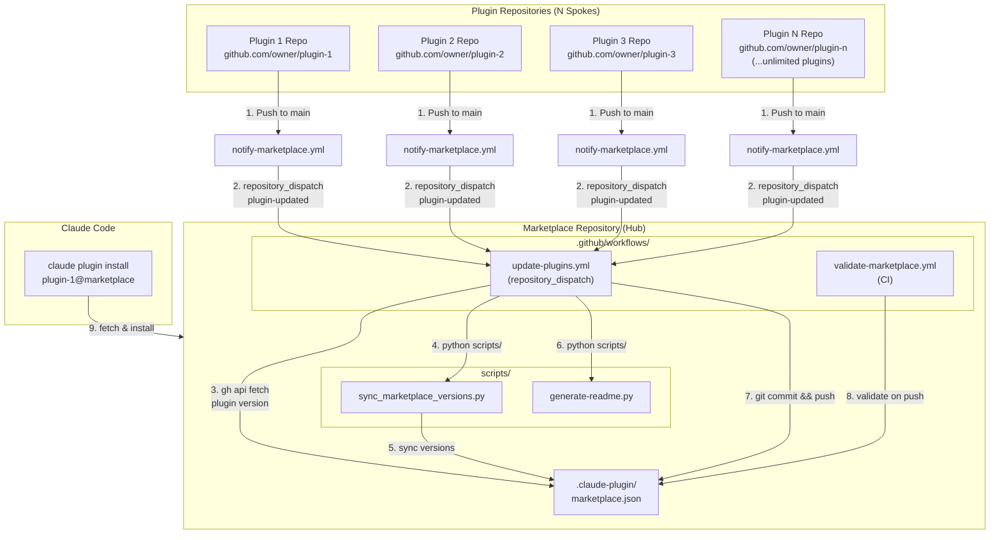

# Marketplace Architecture Reference

Complete reference for the Hub-and-Spoke Architecture used by Claude Code plugin marketplaces: 1 marketplace hub + N plugin spokes (unlimited plugins). Includes notification flows, schemas, PAT configuration, and directory conventions.

## Table of Contents

- [Hub-and-Spoke Architecture](#hub-and-spoke-architecture)
- [Notification Flow](#notification-flow)
- [marketplace.json Schema](#marketplacejson-schema)
- [Plugin Entry Schema](#plugin-entry-schema)
- [MARKETPLACE_PAT Configuration](#marketplace_pat-configuration)
- [Directory Structure](#directory-structure)
- [Event Types](#event-types)
- [Validation Pipeline](#validation-pipeline)

---

## Hub-and-Spoke Architecture

The Claude Code plugin marketplace uses a hub-and-spoke architecture: 1 marketplace hub + N plugin spokes (unlimited plugins). This separates concerns between plugin development, plugin aggregation, and plugin consumption.

### Repository Roles

1. **Plugin Repositories (Spokes)** -- Each plugin lives in its own Git repository with its own version history, CI, and release process. Contains the plugin source code (`.claude-plugin/plugin.json`, agents, skills, commands, hooks). There is no limit to the number of plugin repositories.

2. **Marketplace Repository (Hub)** -- Central registry that aggregates all plugins. Contains `.claude-plugin/marketplace.json` with metadata for every registered plugin. Plugins are registered in `marketplace.json` with GitHub source configuration, and the marketplace uses `gh api` to fetch plugin versions from their source repositories.

3. **Consumer (Claude Code)** -- Claude Code instances that discover, install, and update plugins from the marketplace. Consumers interact with the marketplace via `claude plugin` CLI commands.

### Architecture Diagram



### Why Hub-and-Spoke?

| Concern | Where It Lives | Why Separate |
|---------|---------------|--------------|
| Plugin code & logic | Plugin repos (N spokes) | Independent versioning, CI, contributors per plugin |
| Plugin registry & discovery | Marketplace repo (1 hub) | Single source of truth for all available plugins |
| Plugin installation & usage | Consumer (Claude Code) | User-facing, reads from marketplace hub |

This separation means plugin authors never touch the marketplace directly. They push to their own repo (spoke) and the marketplace hub updates itself automatically via GitHub Actions. New plugins are added by registering them in `marketplace.json` -- there is no limit to the number of plugins a marketplace can aggregate.

---

## Notification Flow

Step-by-step flow when a plugin is pushed to its source repository:

### Step 1: Developer Pushes to Plugin Repo

A developer pushes changes to the plugin repository's `main` (or `master`) branch. The push must modify files that match the path filter in the `notify-marketplace.yml` workflow (typically `.claude-plugin/plugin.json`, `commands/**`, `agents/**`, `skills/**`, `hooks/**`, `scripts/**`).

### Step 2: notify-marketplace.yml Fires

The plugin repository's `notify-marketplace.yml` workflow triggers on the push event. It reads `plugin.json` to extract the plugin name and current version.

### Step 3: Repository Dispatch Sent

The workflow uses `peter-evans/repository-dispatch@v3` to send a `plugin-updated` event to the marketplace repository. The event payload includes:
- `plugin` -- the plugin name from `plugin.json`
- `version` -- the plugin version from `plugin.json`

This requires a `MARKETPLACE_PAT` secret with cross-repo permissions.

### Step 4: Marketplace Receives Dispatch

The marketplace repository's `update-plugins.yml` workflow is triggered by the `repository_dispatch` event with `event_type: plugin-updated`.

### Step 5: GitHub API Version Fetch

The workflow uses `gh api` to fetch the plugin's current `plugin.json` from its source repository, extracting the latest version without needing local clones or submodules.

### Step 6: Version Synchronization

The `sync_marketplace_versions.py` script executes to:
- Use the GitHub API to read `plugin.json` from each plugin's source repository
- Extract the current version string
- Update the corresponding entry in `marketplace.json` with the new version

### Step 7: README Regeneration

The `generate-readme.py` script runs to update the plugin table in the marketplace README with current names, descriptions, versions, and repository links.

### Step 8: Commit and Push

The workflow commits the updated `marketplace.json` and `README.md`, then pushes to the marketplace repository.

### Step 9: CI Validation

The push to the marketplace repository triggers `validate-marketplace.yml`, which runs the full validation suite to ensure `marketplace.json` is valid, all plugin entries have valid source configurations, and documentation is complete.

### Step 10: Consumer Installation

Claude Code users can now install the updated plugin version using `claude plugin install plugin-name@marketplace-name`.

---

## marketplace.json Schema

The `marketplace.json` file is located at `.claude-plugin/marketplace.json` in the marketplace repository root.

### Required Fields

```json
{
  "name": "my-marketplace",
  "owner": {
    "name": "Organization Name"
  },
  "plugins": []
}
```

| Field | Type | Required | Description |
|-------|------|----------|-------------|
| `name` | string | Yes | Unique marketplace identifier (kebab-case) |
| `owner` | object | Yes | Marketplace owner information |
| `owner.name` | string | Yes | Owner display name |
| `plugins` | array | Yes | List of plugin entries |

### Optional Fields

| Field | Type | Description |
|-------|------|-------------|
| `owner.url` | string | Owner website URL |
| `owner.email` | string | Owner contact email |
| `version` | string | Marketplace version (strict semver: `X.Y.Z`) |
| `description` | string | Human-readable marketplace description |

### Reserved Marketplace Names

The following names are reserved and will be rejected by the validator:

| Reserved Name | Reason |
|---------------|--------|
| `official` | Reserved for Anthropic official marketplace |
| `anthropic` | Reserved for Anthropic brand |
| `claude` | Reserved for Anthropic brand |
| `test` | Reserved to prevent accidental production use |
| `example` | Reserved to prevent accidental production use |
| `demo` | Reserved to prevent accidental production use |

### Version Format

All `version` fields must follow strict semver: `X.Y.Z` where X, Y, and Z are non-negative integers. Strings like `"1.0"`, `"v1.0.0"`, or `"latest"` are invalid.

### Complete Example

```json
{
  "name": "dev-tools-marketplace",
  "owner": {
    "name": "Acme Corp",
    "url": "https://acme.example.com",
    "email": "plugins@acme.example.com"
  },
  "version": "1.0.0",
  "description": "Development tools and utilities for Claude Code",
  "plugins": [
    {
      "name": "code-formatter",
      "version": "2.1.0",
      "description": "Automatic code formatting for multiple languages",
      "source": "./code-formatter",
      "repository": "https://github.com/acme/code-formatter",
      "tags": ["formatting", "code-quality"]
    },
    {
      "name": "test-runner",
      "version": "1.5.0",
      "description": "Test automation and reporting",
      "source": "./test-runner",
      "repository": "https://github.com/acme/test-runner"
    }
  ]
}
```

---

## Plugin Entry Schema

Each object in the `plugins` array describes a single plugin available in the marketplace.

### Required Fields

| Field | Type | Required | Description |
|-------|------|----------|-------------|
| `name` | string | Yes | Plugin identifier (kebab-case, unique within marketplace) |
| `source` | string or object | Yes | Where Claude Code finds the plugin |

### Optional Fields

| Field | Type | Description |
|-------|------|-------------|
| `version` | string | Plugin version (semver `X.Y.Z`) |
| `description` | string | Brief plugin description |
| `repository` | string | Source repository URL (for reference) |
| `homepage` | string | Plugin homepage URL |
| `license` | string | License identifier (e.g., `"MIT"`) |
| `keywords` | array | Array of keyword strings for discovery |
| `author` | string or object | Plugin author (string or `{"name": "...", "email": "..."}`) |
| `icon` | string | URL to plugin icon image |
| `tags` | array | Categorization tags |
| `dependencies` | array | Required plugin names |
| `enabled` | boolean | Default enabled state |

### Source Field Format

The `source` field format depends on how the plugin is distributed:

| Scenario | source Format | Example |
|----------|---------------|---------|
| Plugin as local subdirectory | String path | `"./my-plugin"` |
| Plugin from GitHub (hub-and-spoke) | Object | `{"type": "github", "owner": "acme", "repo": "plugin-name"}` |
| Plugin cloned from remote | Object | `{"type": "git", "repository": "https://..."}` |
| Plugin from npm | Object | `{"type": "npm", "package": "@org/plugin"}` |
| Plugin from PyPI | Object | `{"type": "pip", "package": "claude-plugin-x"}` |
| Plugin from URL | Object | `{"type": "url", "url": "https://...plugin.tar.gz"}` |

**Critical:** For hub-and-spoke marketplaces, plugins are registered in `marketplace.json` with GitHub source configuration. The marketplace uses `gh api` to fetch plugin metadata and versions from their source repositories -- no Git submodules are needed.

---

## MARKETPLACE_PAT Configuration

A GitHub Personal Access Token (PAT) is required for the cross-repo `repository_dispatch` communication between plugin repositories and the marketplace repository.

### Required Permissions

| Permission | Scope | Reason |
|------------|-------|--------|
| Contents | Read and Write | Push marketplace.json updates and read plugin repo contents via API |
| Metadata | Read-only | Access repository information |
| Actions | Read and Write | Trigger and manage workflows |

### Setup Steps

1. Navigate to GitHub > Settings > Developer Settings > Personal Access Tokens > Fine-grained tokens.

2. Create a new token with:
   - **Name:** `MARKETPLACE_PAT` (or any descriptive name)
   - **Expiration:** 90 days recommended (set a calendar reminder)
   - **Repository access:** Select the marketplace repository AND all plugin repositories that will send notifications
   - **Permissions:** Contents (Read and Write), Metadata (Read-only), Actions (Read and Write)

3. Copy the generated token value immediately (it will not be shown again).

4. Add the token as a secret on each plugin repository:
   ```bash
   gh secret set MARKETPLACE_PAT --repo owner/plugin-name-a
   gh secret set MARKETPLACE_PAT --repo owner/plugin-name-b
   ```

5. Add the token as a secret on the marketplace repository (needed for GitHub API access and pushing marketplace.json updates):
   ```bash
   gh secret set MARKETPLACE_PAT --repo owner/marketplace-name
   ```

### Token Rotation

- Fine-grained tokens have mandatory expiration dates. Set a calendar reminder before expiration.
- When rotating, update the secret on ALL repositories (marketplace + every plugin repo).
- Verify secrets exist after rotation:
  ```bash
  gh secret list --repo owner/marketplace-name
  gh secret list --repo owner/plugin-name
  ```
- If a token expires before rotation, all `repository_dispatch` notifications will silently fail. Plugins will still work but the marketplace will not auto-update.

---

## Directory Structure

### Marketplace Repository Layout

```
marketplace-repo/
├── .claude-plugin/
│   └── marketplace.json            # Central plugin registry (hub)
├── .github/
│   └── workflows/
│       ├── update-plugins.yml      # Receives plugin-updated dispatch events
│       └── validate-marketplace.yml # CI validation on push/PR
├── scripts/
│   ├── sync_marketplace_versions.py # Fetches plugin.json via GitHub API, updates marketplace.json
│   └── generate-readme.py           # Auto-generates README plugin table
├── README.md                        # Auto-generated marketplace documentation
├── LICENSE                          # Repository license
└── .gitignore
```

Note: The marketplace hub does not contain plugin source code. Plugin metadata is fetched from spoke repositories via the GitHub API at sync time. The `marketplace.json` file is the single source of truth for all registered plugins and their versions.

### Plugin Repository Layout (Minimum)

```
plugin-repo/
├── .claude-plugin/
│   └── plugin.json                 # Plugin metadata (name, version, description)
├── .github/
│   └── workflows/
│       └── notify-marketplace.yml  # Sends repository_dispatch on push
├── commands/                       # Slash commands (optional)
├── agents/                         # Agent configurations (optional)
├── skills/                         # Skills with SKILL.md (optional)
├── hooks/                          # Hook scripts (optional)
├── scripts/                        # Utility scripts (optional)
└── README.md
```

---

## Event Types

### repository_dispatch Events

| Event Type | Source | Target | Trigger |
|------------|--------|--------|---------|
| `plugin-updated` | Plugin repo (`notify-marketplace.yml`) | Marketplace repo (`update-plugins.yml`) | Push to main with plugin file changes |

#### plugin-updated Payload

```json
{
  "event_type": "plugin-updated",
  "client_payload": {
    "plugin": "plugin-name",
    "version": "1.2.3"
  }
}
```

### workflow_dispatch Events

| Event Type | Source | Target | Trigger |
|------------|--------|--------|---------|
| `workflow_dispatch` | Manual (GitHub UI or `gh workflow run`) | Marketplace repo (`update-plugins.yml`) | Manual sync trigger |

Used for manual re-synchronization when automatic dispatch fails or when adding a new plugin for the first time.

### push Events

| Event Type | Source | Target | Trigger |
|------------|--------|--------|---------|
| `push` | Any commit to marketplace main branch | Marketplace repo (`validate-marketplace.yml`) | Commit pushed to main |

Triggers the validation pipeline to ensure the marketplace remains in a valid state after any update.

---

## Validation Pipeline

After the marketplace repository is updated (either automatically via dispatch or manually), the `validate-marketplace.yml` workflow runs these checks:

1. **JSON Validity** -- `marketplace.json` must be valid JSON
2. **Required Fields** -- `name`, `owner`, `owner.name`, `plugins` must be present
3. **Name Validation** -- Marketplace name must be kebab-case and not reserved
4. **Version Format** -- All version strings must be strict semver `X.Y.Z`
5. **Plugin Uniqueness** -- No duplicate plugin names
6. **Source Validation** -- Each plugin must have a valid `source` field
7. **Source Reachability** -- Plugin source repositories must be accessible and contain valid `plugin.json`
8. **Documentation** -- README must contain Installation, Update, Uninstall, and Troubleshooting sections

Run validation locally:

```bash
uv run python scripts/validate_marketplace.py /path/to/marketplace --verbose
```
