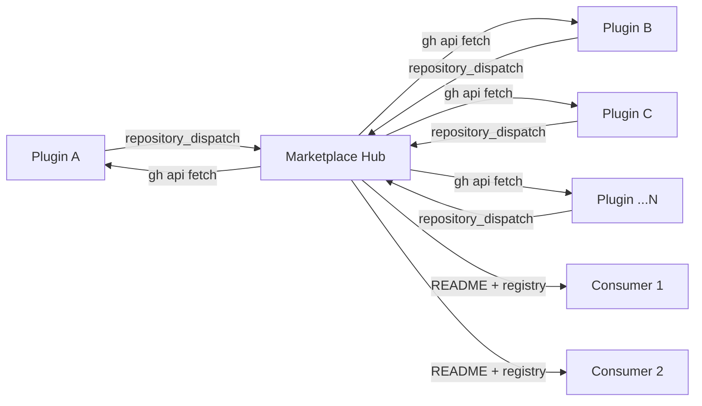

# Marketplace Setup Guide

## Table of Contents
- [Overview](#overview)
- [Prerequisites](#prerequisites)
- [Arguments](#arguments)
- [Phase 1: Create Marketplace Repository](#phase-1-create-marketplace-repository)
- [Phase 2: Install Infrastructure](#phase-2-install-infrastructure)
- [Phase 3: Link Plugin Repos](#phase-3-link-plugin-repos-batch)
- [Phase 4: Plugin Management](#phase-4-plugin-management)
- [Phase 5: Validate and Verify](#phase-5-validate-and-verify)
- [Error Handling](#error-handling)
- [Examples](#examples)

Complete step-by-step instructions for creating, configuring, and managing a GitHub marketplace for Claude Code plugins.

## Overview

This skill implements a **hub-and-spoke architecture** for distributing Claude Code plugins:

- **Hub** -- a single marketplace repository that serves as the central registry
- **Spokes** -- any number of plugin repositories, each independently developed and versioned

There is no fixed repo count. One marketplace can aggregate 1 plugin or 1,000 plugins. The marketplace fetches plugin metadata via the **GitHub API** (not git submodules) and uses **repository_dispatch** events for real-time update notifications.



### Scenarios

**Create a marketplace for multiple plugins:**
> "Create a marketplace for these 10 plugins: svg-tools, code-formatter, test-runner, doc-gen, lint-helper, deploy-assist, schema-validator, api-client, log-parser, metrics-dashboard"

**Add plugins to an existing marketplace:**
> "Add plugins markdown-preview and diagram-builder to my marketplace awesome-claude-plugins"

**Migrate plugins between marketplaces:**
> "Move plugins svg-tools and code-formatter from marketplace old-plugins to marketplace new-plugins"

### Components created

- **marketplace.json** -- plugin registry with metadata, versions, source config
- **GitHub Actions workflows** -- validation, API-based sync, notification chain
- **Sync scripts** -- version sync via GitHub API, README generation, hooks
- **Auto-updating README** -- plugin table and diagram regenerated on every update

## Prerequisites

- `gh` CLI installed and authenticated (`gh auth status`)
- Git configured with `user.name` and `user.email`
- GitHub account with repo creation permission
- **MARKETPLACE_PAT** token with `repo` + `workflow` scopes
- At least one plugin repo to link (optional)

## Arguments

| Argument | Required | Description |
|----------|----------|-------------|
| `<marketplace-name>` | Yes | Repository name in kebab-case (e.g. `my-claude-plugins`) |
| `--owner <github-username>` | No | GitHub owner/org. Defaults to `gh api user -q .login` |
| `--plugin <repo>` | No | Repeatable. One or more plugin repos to link. Use multiple times: `--plugin repo1 --plugin repo2 --plugin repo3` |
| `--source-marketplace <name>` | No | For migration: source marketplace to move plugins from |

When `--plugin` is provided multiple times, all listed plugins are processed as a batch in Phase 3.

## Phase 1: Create Marketplace Repository

### Step 1: Resolve owner and check existence

```bash
OWNER=<placeholder-for-github-repo-owner>
[ -z "$OWNER" ] && OWNER=$(gh api user -q .login)
gh repo view "$OWNER/<placeholder-for-marketplace-repo-name>" --json name 2>/dev/null && echo "Repo exists, skip to Phase 2"
```

### Step 2: Create, clone, and initialize

```bash
gh repo create "$OWNER/<placeholder-for-marketplace-repo-name>" --public --description "Claude Code plugin marketplace"
gh repo clone "$OWNER/<placeholder-for-marketplace-repo-name>" && cd "<placeholder-for-marketplace-repo-name>"
mkdir -p .claude-plugin .github/workflows scripts
```

Write `.claude-plugin/marketplace.json` with name, version `"1.0.0"`, owner, and empty `"plugins": []` array.

### Step 3: Commit and push

```bash
git add -A && git commit -m "Initialize marketplace structure" && git push
```

Reference: [Marketplace Architecture](marketplace-architecture.md)
  - Hub-and-Spoke Architecture
  - Notification Flow
  - marketplace.json Schema
  - Plugin Entry Schema
  - MARKETPLACE_PAT Configuration
  - Directory Structure
  - Event Types
  - Validation Pipeline

## Phase 2: Install Infrastructure

### Step 1: Install GitHub Actions workflows

Copy into `.github/workflows/`, replacing `<placeholder-for-marketplace-owner>` and `<placeholder-for-marketplace-repo-name>`:

- **update-submodules.yml** -- triggered by `repository_dispatch`; fetches plugin metadata via `gh api`, updates versions, regenerates README
- **validate-marketplace.yml** -- runs on push/PR; validates schema, checks plugin entries via GitHub API, runs cpv

Reference: [Workflow Templates](workflow-templates.md)
  - Placeholder Reference
  - notify-marketplace.yml (Plugin Side)
  - update-submodules.yml (Marketplace Side)
  - validate-marketplace.yml (Marketplace CI)
  - Plugin CI Workflow (Optional)

### Step 2: Install sync scripts

Copy these scripts into `scripts/`:

- **sync_marketplace_versions.py** -- fetches each plugin's `plugin.json` via `gh api`, decodes base64, updates marketplace.json
- **update_marketplace_metadata.py** -- generates README.md with plugin table, architecture diagram, install instructions
- **setup_git_hooks.py** -- installs git pre-push hooks that run cpv validation before pushing

```bash
chmod +x scripts/*.py
```

Reference: [Script Templates](script-templates.md)
  - Placeholder Reference
  - sync_marketplace_versions.py
  - update_marketplace_metadata.py
  - setup_git_hooks.py
  - pre-push-hook.py
  - push-plugins.py

### Step 3: Generate README, commit infrastructure

```bash
uv run python scripts/update_marketplace_metadata.py --marketplace-dir .
git add -A && git commit -m "Install CI/CD infrastructure" && git push
```

## Phase 3: Link Plugin Repos (Batch)

This phase processes ALL plugins provided via `--plugin` arguments as a single batch. Whether 1 plugin or 100, the logic is identical.

### Step 1: Build the plugin list

Collect all plugins from `--plugin` arguments into an array:

```bash
PLUGINS=()
for arg in "$@"; do PLUGINS+=("$arg"); done
```

### Step 2: Fetch metadata and register each plugin

For EACH plugin, fetch `plugin.json` via GitHub API and add an entry to `marketplace.json`:

```bash
for PLUGIN in "${PLUGINS[@]}"; do
  PLUGIN_JSON=$(gh api "repos/$OWNER/$PLUGIN/contents/.claude-plugin/plugin.json" \
    -q '.content' | base64 --decode)
  VERSION=$(echo "$PLUGIN_JSON" | jq -r '.version // "0.0.0"')
  DESCRIPTION=$(echo "$PLUGIN_JSON" | jq -r '.description // ""')
  jq --arg name "$PLUGIN" --arg version "$VERSION" --arg desc "$DESCRIPTION" --arg owner "$OWNER" \
     '.plugins += [{"name": $name, "source": {"type": "github", "owner": $owner, "repo": $name}, "version": $version, "description": $desc}]' \
     .claude-plugin/marketplace.json > tmp.json && mv tmp.json .claude-plugin/marketplace.json
done
```

### Step 3: Install notify workflow on each plugin repo

For EACH plugin, install `.github/workflows/notify-marketplace.yml` via `gh api`. This workflow fires a `repository_dispatch` to the marketplace on every push:

```bash
for PLUGIN in "${PLUGINS[@]}"; do
  WORKFLOW_CONTENT=$(cat templates/github-workflows/notify-marketplace.yml | \
    sed "s/<placeholder-for-marketplace-owner>/$OWNER/g" | sed "s/<placeholder-for-marketplace-repo-name>/$MARKETPLACE/g")
  EXISTING=$(gh api "repos/$OWNER/$PLUGIN/contents/.github/workflows/notify-marketplace.yml" \
    -q '.sha' 2>/dev/null || echo "")
  if [ -n "$EXISTING" ]; then
    gh api --method PUT "repos/$OWNER/$PLUGIN/contents/.github/workflows/notify-marketplace.yml" \
      -f message="Update notify-marketplace.yml for $MARKETPLACE" \
      -f content="$(echo "$WORKFLOW_CONTENT" | base64)" -f sha="$EXISTING"
  else
    gh api --method PUT "repos/$OWNER/$PLUGIN/contents/.github/workflows/notify-marketplace.yml" \
      -f message="Install notify-marketplace.yml for <placeholder-for-marketplace-repo-name>" \
      -f content="$(echo "$WORKFLOW_CONTENT" | base64)"
  fi
done
```

### Step 4: Configure MARKETPLACE_PAT secret (autonomous, batch)

Check which repos are missing the secret. If any are missing, ask the user ONCE, then set on all:

```bash
MISSING=()
for PLUGIN in "${PLUGINS[@]}"; do
  HAS=$(gh secret list --repo "$OWNER/$PLUGIN" 2>/dev/null | grep -c "MARKETPLACE_PAT" || true)
  [ "$HAS" -eq 0 ] && MISSING+=("$PLUGIN")
done
if [ ${#MISSING[@]} -gt 0 ]; then
  PAT=$(AskUserQuestion "MARKETPLACE_PAT missing on ${#MISSING[@]} repos: ${MISSING[*]}. Provide PAT (repo+workflow scopes):")
  for REPO in "${MISSING[@]}"; do
    gh secret set MARKETPLACE_PAT --body "$PAT" --repo "$OWNER/$REPO"
  done
fi
```

### Step 5: Commit, sync, and generate README

```bash
git add -A && git commit -m "Link ${#PLUGINS[@]} plugins: ${PLUGINS[*]}" && git push
uv run python scripts/sync_marketplace_versions.py --marketplace-dir .
uv run python scripts/update_marketplace_metadata.py --marketplace-dir .
git add -A && git commit -m "Sync versions and regenerate README" && git push
```

Reference: [Plugin Linking Guide](plugin-linking-guide.md)
  - Adding a Plugin to the Marketplace
  - Removing a Plugin from the Marketplace
  - Configuring MARKETPLACE_PAT Secret
  - Installing Notification Workflow
  - Testing the Notification Chain
  - Migrating Plugins Between Marketplaces
  - Batch Operations

## Phase 4: Plugin Management

### Add plugins (batch)

Repeat Phase 3 with the new plugin list. The `marketplace.json` is appended to, not overwritten. Phase 3 runs identically for 1 or N plugins.

### Remove plugins (batch)

For each plugin: remove from `marketplace.json`, delete `notify-marketplace.yml` from the plugin repo, regenerate README.

```bash
for PLUGIN in "${PLUGINS_TO_REMOVE[@]}"; do
  jq --arg name "$PLUGIN" '.plugins = [.plugins[] | select(.name != $name)]' \
    .claude-plugin/marketplace.json > tmp.json && mv tmp.json .claude-plugin/marketplace.json
  SHA=$(gh api "repos/$OWNER/$PLUGIN/contents/.github/workflows/notify-marketplace.yml" -q '.sha' 2>/dev/null || echo "")
  [ -n "$SHA" ] && gh api --method DELETE "repos/$OWNER/$PLUGIN/contents/.github/workflows/notify-marketplace.yml" \
    -f message="Remove marketplace notification" -f sha="$SHA"
done
uv run python scripts/update_marketplace_metadata.py --marketplace-dir .
git add -A && git commit -m "Remove plugins: ${PLUGINS_TO_REMOVE[*]}" && git push
```

### Update plugins (automatic via CI)

Automatic: developer pushes to plugin repo -> `notify-marketplace.yml` fires `repository_dispatch` -> marketplace `update-submodules.yml` fetches latest `plugin.json` via `gh api` -> README regenerated.

### Migrate plugins between marketplaces

Move plugins from `--source-marketplace` to `<placeholder-for-marketplace-repo-name>`. Both must exist. For each plugin: copy entry to target `marketplace.json`, repoint `notify-marketplace.yml` to target via `gh api`, remove entry from source, regenerate READMEs on both, validate both.

```bash
SOURCE="<placeholder-for-source-marketplace>" && TARGET="<placeholder-for-marketplace-repo-name>"
SOURCE_JSON=$(gh api "repos/$OWNER/$SOURCE/contents/.claude-plugin/marketplace.json" -q '.content' | base64 --decode)
for PLUGIN in "${PLUGINS_TO_MIGRATE[@]}"; do
  ENTRY=$(echo "$SOURCE_JSON" | jq --arg name "$PLUGIN" '.plugins[] | select(.name == $name)')
  jq --argjson entry "$ENTRY" '.plugins += [$entry]' .claude-plugin/marketplace.json > tmp.json && mv tmp.json .claude-plugin/marketplace.json
  WORKFLOW=$(cat templates/github-workflows/notify-marketplace.yml | sed "s/<placeholder-for-marketplace-owner>/$OWNER/g" | sed "s/<placeholder-for-marketplace-repo-name>/$TARGET/g")
  SHA=$(gh api "repos/$OWNER/$PLUGIN/contents/.github/workflows/notify-marketplace.yml" -q '.sha' 2>/dev/null)
  gh api --method PUT "repos/$OWNER/$PLUGIN/contents/.github/workflows/notify-marketplace.yml" \
    -f message="Migrate to $TARGET" -f content="$(echo "$WORKFLOW" | base64)" -f sha="$SHA"
done
# Update source: remove entries, regenerate, push
gh repo clone "$OWNER/$SOURCE" /tmp/source-mkt && cd /tmp/source-mkt
for P in "${PLUGINS_TO_MIGRATE[@]}"; do
  jq --arg name "$P" '.plugins = [.plugins[] | select(.name != $name)]' .claude-plugin/marketplace.json > tmp.json && mv tmp.json .claude-plugin/marketplace.json
done
uv run python scripts/update_marketplace_metadata.py --marketplace-dir . && git add -A && git commit -m "Migrate out: ${PLUGINS_TO_MIGRATE[*]}" && git push
# Update target: regenerate, push, validate both
cd "$TARGET" && uv run python scripts/update_marketplace_metadata.py --marketplace-dir .
git add -A && git commit -m "Migrate in: ${PLUGINS_TO_MIGRATE[*]}" && git push
uv run python scripts/validate_marketplace.py /tmp/source-mkt --verbose --report docs_dev/validate_marketplace_source_YYYYMMDD.md
uv run python scripts/validate_marketplace.py "$TARGET" --verbose --report docs_dev/validate_marketplace_target_YYYYMMDD.md
```

Reference: [Plugin Linking Guide](plugin-linking-guide.md)
  - Adding a Plugin to the Marketplace
  - Removing a Plugin from the Marketplace
  - Updating a Plugin Version
  - Migrating Plugins Between Marketplaces
  - Batch Operations

## Phase 5: Validate and Verify

### Step 1: Validate marketplace structure

```bash
uv run python scripts/validate_marketplace.py <placeholder-for-marketplace-path> --verbose --report docs_dev/validate_marketplace_YYYYMMDD.md
```

Confirm: marketplace.json is valid, all plugin entries have source config, workflows are installed.

### Step 2: Validate each plugin via GitHub API

For each plugin in `marketplace.json`, verify: repo exists, `plugin.json` fetchable, `notify-marketplace.yml` installed, `MARKETPLACE_PAT` secret set.

```bash
for PLUGIN in $(jq -r '.plugins[].name' .claude-plugin/marketplace.json); do
  gh repo view "$OWNER/$PLUGIN" --json name > /dev/null
  gh api "repos/$OWNER/$PLUGIN/contents/.claude-plugin/plugin.json" -q '.name' > /dev/null
  gh api "repos/$OWNER/$PLUGIN/contents/.github/workflows/notify-marketplace.yml" -q '.name' > /dev/null
  gh secret list --repo "$OWNER/$PLUGIN" | grep -q "MARKETPLACE_PAT"
  echo "$PLUGIN: OK"
done
```

### Step 3: Test end-to-end notification chain

Trigger one plugin's notification workflow and verify the marketplace receives the dispatch:

```bash
FIRST_PLUGIN=$(jq -r '.plugins[0].name' .claude-plugin/marketplace.json)
gh workflow run notify-marketplace.yml --repo "$OWNER/$FIRST_PLUGIN"
```

### Step 4: Install hooks and verify CI

```bash
uv run python scripts/setup_git_hooks.py --marketplace-dir <placeholder-for-marketplace-path>
gh run list --repo "$OWNER/<placeholder-for-marketplace-repo-name>" --limit 5
```

Confirm pre-push hooks are active and recent workflow runs completed successfully.

## Error Handling

| Error | Cause | Resolution |
|-------|-------|------------|
| `MARKETPLACE_PAT` missing or invalid | Token not set or lacks `repo`+`workflow` scopes | Re-create PAT with correct scopes, set via `gh secret set MARKETPLACE_PAT --body <token> --repo owner/repo` |
| `plugin.json` not found via API | Plugin repo missing `.claude-plugin/plugin.json` | Ensure the plugin has a valid `plugin.json` at `.claude-plugin/plugin.json` and the repo is public or PAT has access |
| Workflow dispatch not received | `notify-marketplace.yml` not installed or PAT cannot trigger dispatch | Re-install the notification workflow on the plugin repo and verify PAT scopes |
| `gh auth` failure | CLI not authenticated | Run `gh auth login` and verify with `gh auth status` |
| `validate_marketplace.py` fails | Malformed `marketplace.json` or unreachable plugin repos | Check JSON syntax, verify all plugin repos exist, and confirm API access |

## Examples

**Create a new marketplace with two plugins:**

```
set up marketplace my-claude-plugins --plugin svg-tools --plugin code-formatter
```

Expected: creates `my-claude-plugins` repo, links both plugins, installs CI/CD, generates README.

**Add a plugin to an existing marketplace:**

```
link plugin test-runner to marketplace my-claude-plugins
```

Expected: fetches `test-runner` metadata, adds entry to `marketplace.json`, installs notification workflow.

**Migrate plugins between marketplaces:**

```
move plugins svg-tools code-formatter from old-plugins to new-plugins
```

Expected: copies entries to target, repoints notification workflows, removes from source, validates both.

## Completion Checklist

Copy this checklist and track your progress as you complete each step.

### Repository Setup
- [ ] Marketplace repo created, public, with LICENSE and .gitignore
- [ ] .claude-plugin/marketplace.json valid; README.md generated

### CI/CD and Scripts
- [ ] update-submodules.yml + validate-marketplace.yml installed and tested
- [ ] MARKETPLACE_PAT secret on marketplace repo; workflow permissions set
- [ ] sync/generate/hooks scripts installed, executable, run with `uv run`

### Plugin Linking (for each plugin repo)
- [ ] Metadata fetched via `gh api`, entry added to marketplace.json
- [ ] notify-marketplace.yml installed via `gh api`; MARKETPLACE_PAT set via `gh secret set --body`
- [ ] Notification chain tested; plugin passes cpv validation

### Validation
- [ ] validate_marketplace.py passes --verbose on marketplace repo
- [ ] All plugin repos reachable via GitHub API with notify-marketplace.yml and MARKETPLACE_PAT
- [ ] Git pre-push hooks installed; CI validation runs on PR and push
- [ ] Zero major findings across all validations

### Documentation and Security
- [ ] README.md has Mermaid diagram, plugin table, install instructions, dev guide, maintenance section
- [ ] CONTRIBUTING.md added with plugin submission guidelines
- [ ] MARKETPLACE_PAT scoped to repo + workflow only; no secrets in git history
- [ ] .gitignore covers .env, *.pem, credentials; branch protection on main
