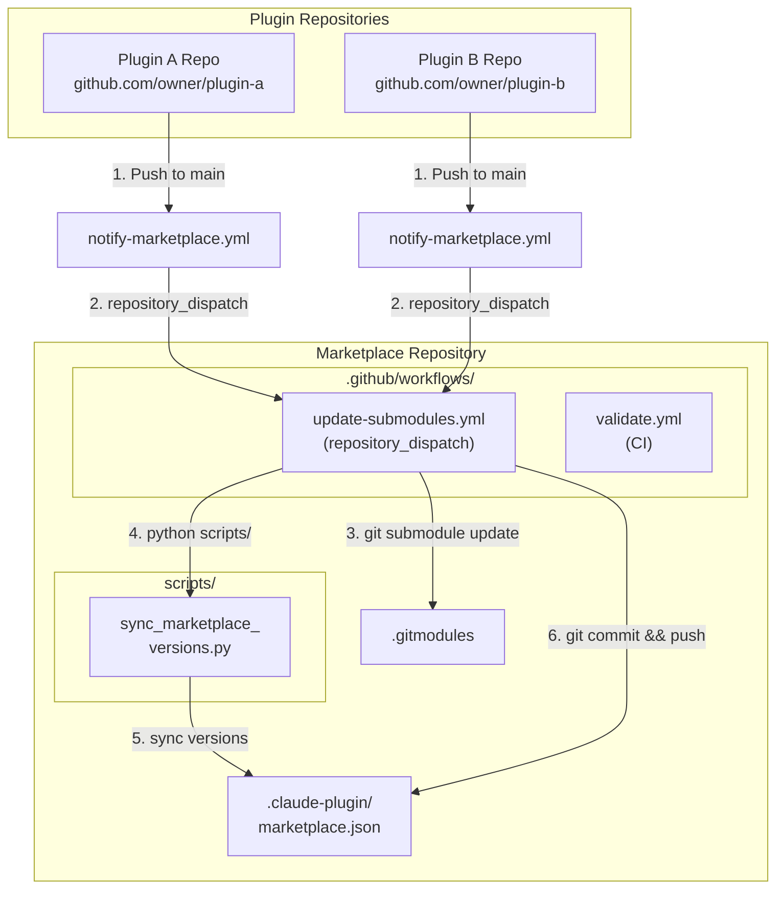

# <!-- Replace with your marketplace name --> Marketplace

<!-- Replace this section with a description of your marketplace -->

A curated collection of Claude Code plugins for <!-- describe the purpose or theme of this marketplace -->.

This marketplace provides a centralized repository where plugins are maintained as Git submodules, automatically updated when their source repositories change.

---

## Architecture

The marketplace uses a Git submodule-based architecture with automated synchronization via GitHub Actions.



---

## Update Flow Explanation

When a plugin in its source repository is updated, the following sequence occurs:

### Step 1: Plugin Push Triggers Notification

When a developer pushes changes to a plugin repository's `main` branch, the `notify-marketplace.yml` workflow in that repository fires.

### Step 2: Repository Dispatch Event

The notification workflow sends a `repository_dispatch` event to this marketplace repository. This is a GitHub API mechanism that allows one repository to trigger workflows in another repository.

The dispatch event includes:
- `event_type`: `"plugin-updated"`
- `client_payload`: Contains the plugin name and new version

### Step 3: Marketplace Receives Update

The `update-submodules.yml` workflow in this marketplace repository is triggered by the dispatch event.

### Step 4: Submodule Update

The workflow updates the Git submodule for the changed plugin to pull the latest commit from the plugin's source repository.

### Step 5: Version Synchronization

The `sync_marketplace_versions.py` script runs to:
- Read the `plugin.json` from each submodule
- Extract the current version
- Update `marketplace.json` with the new version information

### Step 6: Commit and Push

The workflow commits the updated `.gitmodules` reference and `marketplace.json`, then pushes to the marketplace repository.

---

## Available Plugins

<!-- Update this table with your actual plugins -->

| Plugin Name | Description | Version | Repository |
|-------------|-------------|---------|------------|
| <!-- plugin-name --> | <!-- Brief description --> | <!-- x.y.z --> | [Link](<!-- https://github.com/owner/repo -->) |
| <!-- plugin-name --> | <!-- Brief description --> | <!-- x.y.z --> | [Link](<!-- https://github.com/owner/repo -->) |

<!--
To generate this table automatically, you can run:
python scripts/generate_plugin_table.py
-->

---

## Installation

### Adding This Marketplace to Claude Code

Register this marketplace with Claude Code:

```bash
# Using HTTPS
claude plugin marketplace add <!-- marketplace-name --> https://github.com/<!-- owner -->/<!-- marketplace-repo -->.git

# Or using SSH
claude plugin marketplace add <!-- marketplace-name --> git@github.com:<!-- owner -->/<!-- marketplace-repo -->.git
```

### Installing Plugins from This Marketplace

Once the marketplace is registered, install any plugin:

```bash
# List available plugins
claude plugin search @<!-- marketplace-name -->

# Install a specific plugin
claude plugin install <!-- plugin-name -->@<!-- marketplace-name -->

# Install with a specific scope
claude plugin install <!-- plugin-name -->@<!-- marketplace-name --> --scope user
claude plugin install <!-- plugin-name -->@<!-- marketplace-name --> --scope project
claude plugin install <!-- plugin-name -->@<!-- marketplace-name --> --scope local
```

### Updating Plugins

To update an installed plugin to the latest version:

```bash
claude plugin update <!-- plugin-name -->@<!-- marketplace-name -->
```

---

## For Plugin Developers

To add your plugin to this marketplace with automatic updates, follow these steps:

### 1. Add the Notification Workflow to Your Plugin Repository

Create `.github/workflows/notify-marketplace.yml` in your plugin repository:

```yaml
name: Notify Marketplace

on:
  push:
    branches:
      - main
    paths:
      - '.claude-plugin/plugin.json'
      - 'commands/**'
      - 'agents/**'
      - 'skills/**'
      - 'hooks/**'
      - 'scripts/**'

jobs:
  notify:
    runs-on: ubuntu-latest
    steps:
      - name: Checkout
        uses: actions/checkout@v4

      - name: Get plugin info
        id: plugin
        run: |
          PLUGIN_NAME=$(jq -r '.name' .claude-plugin/plugin.json)
          PLUGIN_VERSION=$(jq -r '.version' .claude-plugin/plugin.json)
          echo "name=$PLUGIN_NAME" >> $GITHUB_OUTPUT
          echo "version=$PLUGIN_VERSION" >> $GITHUB_OUTPUT

      - name: Notify marketplace
        uses: peter-evans/repository-dispatch@v3
        with:
          token: ${{ secrets.MARKETPLACE_PAT }}
          repository: <!-- owner -->/<!-- marketplace-repo -->
          event-type: plugin-updated
          client-payload: '{"plugin": "${{ steps.plugin.outputs.name }}", "version": "${{ steps.plugin.outputs.version }}"}'
```

### 2. Create a Personal Access Token (PAT)

You need a GitHub PAT with `repo` scope to trigger workflows in the marketplace repository:

1. Go to [GitHub Settings > Developer settings > Personal access tokens > Fine-grained tokens](https://github.com/settings/tokens?type=beta)
2. Click "Generate new token"
3. Configure the token:
   - **Token name**: `marketplace-notify` (or any descriptive name)
   - **Expiration**: Choose appropriate duration
   - **Repository access**: Select "Only select repositories" and choose the marketplace repository
   - **Permissions**:
     - Repository permissions > Contents: Read and write
     - Repository permissions > Metadata: Read-only
4. Generate and copy the token

### 3. Add the PAT as a Repository Secret

In your plugin repository:

1. Go to Settings > Secrets and variables > Actions
2. Click "New repository secret"
3. Name: `MARKETPLACE_PAT`
4. Value: Paste your PAT
5. Click "Add secret"

### 4. Request Addition to the Marketplace

<!-- Customize this section based on your contribution process -->

Open an issue in this marketplace repository requesting your plugin be added. Include:

- Plugin repository URL
- Brief description of the plugin
- Confirmation that you've set up the notification workflow

A maintainer will add your plugin as a submodule and update the marketplace configuration.

---

## Maintenance

### Manually Triggering Submodule Updates

If automatic updates fail or you need to force a sync:

```bash
# Clone the marketplace repository
git clone --recurse-submodules https://github.com/<!-- owner -->/<!-- marketplace-repo -->.git
cd <!-- marketplace-repo -->

# Update all submodules to latest
git submodule update --remote --merge

# Or update a specific submodule
git submodule update --remote --merge plugins/<!-- plugin-name -->

# Run the sync script
python scripts/sync_marketplace_versions.py

# Commit and push
git add .
git commit -m "chore: update submodules"
git push
```

### Adding a New Plugin as a Submodule

To add a new plugin to the marketplace:

```bash
# Add the submodule
git submodule add https://github.com/<!-- plugin-owner -->/<!-- plugin-repo -->.git plugins/<!-- plugin-name -->

# Initialize and update
git submodule update --init --recursive

# Update marketplace.json
python scripts/sync_marketplace_versions.py

# Commit
git add .gitmodules plugins/<!-- plugin-name --> .claude-plugin/marketplace.json
git commit -m "feat: add <!-- plugin-name --> plugin"
git push
```

### Removing a Plugin

To remove a plugin from the marketplace:

```bash
# Remove the submodule entry from .gitmodules
git config -f .gitmodules --remove-section submodule.plugins/<!-- plugin-name -->

# Remove the submodule entry from .git/config
git config -f .git/config --remove-section submodule.plugins/<!-- plugin-name -->

# Remove the submodule directory
git rm --cached plugins/<!-- plugin-name -->
rm -rf plugins/<!-- plugin-name -->
rm -rf .git/modules/plugins/<!-- plugin-name -->

# Update marketplace.json (remove the plugin entry manually or re-run sync)
python scripts/sync_marketplace_versions.py

# Commit
git add .
git commit -m "chore: remove <!-- plugin-name --> plugin"
git push
```

---

## Repository Structure

```
<!-- marketplace-name -->/
+-- .claude-plugin/
|   +-- marketplace.json      # Plugin registry with versions
+-- .github/
|   +-- workflows/
|       +-- update-submodules.yml   # Triggered by plugin updates
|       +-- validate.yml            # CI validation
+-- plugins/                  # Git submodules
|   +-- plugin-a/            # -> github.com/owner/plugin-a
|   +-- plugin-b/            # -> github.com/owner/plugin-b
+-- scripts/
|   +-- sync_marketplace_versions.py
+-- .gitmodules              # Submodule configuration
+-- README.md                # This file
```

---

## Troubleshooting

### Dispatch Event Not Triggering

- Verify the PAT has not expired
- Check that the PAT has correct repository permissions
- Ensure the secret name matches in the workflow (`MARKETPLACE_PAT`)
- Check GitHub Actions logs in both repositories

### Submodule Not Updating

- Verify the submodule URL is correct in `.gitmodules`
- Try manual update: `git submodule update --remote plugins/<name>`
- Check if the plugin repository's main branch has new commits

### Version Mismatch in marketplace.json

- Run `python scripts/sync_marketplace_versions.py` manually
- Verify each plugin's `plugin.json` contains a valid version field

---

## License

<!-- Replace with your license information -->

This marketplace repository is licensed under <!-- LICENSE_NAME -->. Individual plugins maintain their own licenses - see each plugin's repository for details.

---

## Contributing

<!-- Customize based on your contribution guidelines -->

Contributions are welcome! Please see [CONTRIBUTING.md](CONTRIBUTING.md) for guidelines on:

- Adding new plugins
- Reporting issues
- Suggesting improvements

---

<!--
Template version: 1.0.0
Generated for Claude Code plugin marketplace management
-->
